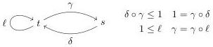

11:44

D. GRATZER, G.A. KAVVOS, A. NUYTS, AND L. BIRKEDAL

Vol. 17:3

Figure 11: The ‘adjoint bowling pin’  \( M_{g} \) : a mode theory for guarded recursion.

The presence of the modality enforces the requirement that the head of the stream is available immediately, but the tail may only be accessed after some productive work has taken place. This allows us to e.g. construct an infinite stream of ones:

\[
\text { inf\_stream\_of\_ones } \triangleq \text { lōb } (s. \text { cons } (1, s))
\]

Unlike the ordinary type of streams,  \( Str_{A} \)  does not behave like a coinductive type: we may only define causal operations, which excludes useful functions (e.g. the tail function). In order to regain coinductive behaviour, [CBGB15] introduced the always modality □, an idempotent comonad for which

\[
\square \blacktriangleright A \simeq \square A. \tag {*}
\]

Combining \(\square\) and \(\blacktriangleright\) in the same system has proven tricky. Previous work has used delayed substitutions [BGC\(^{+}\)16], or replaced \(\square\) with clock quantification [AM13, Møg14, BM15, BGM17]. Neither solution is entirely satisfactory: the former poses serious implementation and usability issues, and the latter does not enjoy the conceptual simplicity of a single modality. We will show that MTT enables us to effortlessly combine the two modalities whilst satisfying (*).

To encode guarded recursion inside MTT, we must

(1) construct a mode theory that induces an applicative functor \(\blacktriangleright\) and an idempotent comonad \(\square\) satisfying (*),
(2) construct the intended model of MTT with this mode theory, i.e. a model where these modalities are interpreted in the standard way [BMSS12], and
(3) include Löb induction as an axiom, and use it to reason about guarded streams.

9.1. A guarded mode theory. We define  \( M_{g} \)  to be the mode theory generated by the graph and equations of Fig. 11. We require that  \( M_{g} \)  be poset-enriched, i.e. that there be at most one 2-cell between a pair of modalities  \( \mu,\nu \), which we denote by  \( \mu\leq\nu \)  when it exists. Consequently, we need not state any coherence equations between 2-cells.

Unlike prior guarded type theories,  \( M_{g} \)  has two modes. We will think of elements of s as being constant types and terms, while types in t may vary over time. Observe that we can thence construct a composite modality  \( b \triangleq \delta \circ \gamma \) . Moreover, this modality is idempotent, for  \( b \circ b = \delta \circ \gamma \circ \delta \circ \gamma = \delta \circ \gamma = b \) . We will prove in Section 9.3 that

Lemma 9.1.  \( \langle b \mid -\rangle \)  is an idempotent comonad and  \( \langle \ell \mid -\rangle \)  is an applicative functor.