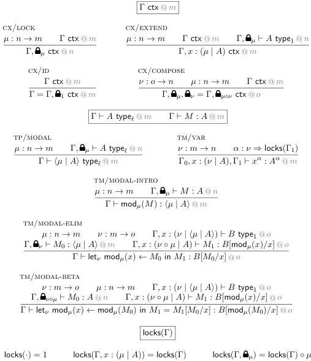

11:8

D. GRATZER, G.A. KAVVOS, A. NUYTS, AND L. BIRKEDAL

Vol. 17:3

Figure 2: Selected modal rules.

In the type theory of  \( [BCM^{+}20] \)  modalities are taken to be dependent right adjoints, with terms witnessing Equation  \( \dagger \) . This isomorphism can encode TM/MODAL-ELIM/SINGLE-MODALITY, but that rule alone cannot encode Equation  \( \dagger \) . As a result, modalities in MTT are weaker than DRAs.

2.3. Multiple Modalities. So far we have only considered a single modality. In this section we discuss the few additional tweaks that are needed to support multiple interacting modalities. The final version of the modal rules is given in Figure 2.