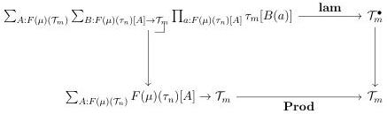
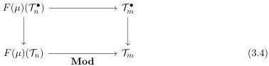
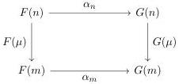

Vol. 22:1

NORMALIZATION FOR MULTIMODAL TYPE THEORY

27:15

The additional requirements imposed by natural models of MTT to encode various connectives can be transferred mutatis mutandis to a cosmos; they are all stated within the language of locally cartesian closed categories.

Definition 3.7. An cosmos F is an MTT cosmos when equipped with the following structure:

(1) In  \( F(m) \) , there is a universe  \( \tau_{m}:T_{m}^{\bullet}\longrightarrow T_{m} \)  with a choice of codes witnessing its closure under dependent sums and products, identity types, and booleans. For instance, a choice of pullback square of the following shape:

(2) For each \(\mu\), there exists a chosen commuting square

(3) For each \(\mu : n \longrightarrow m\) and \(\nu : o \longrightarrow n\), there is a chosen lifting structure \(F(\mu)(m) \pitchfork F(\mu \circ \nu)(\mathcal{T}_o) \times \tau_m\), where \(m : F(\nu)(\mathcal{T}_o^\bullet) \longrightarrow F(\nu)(\mathcal{T}_o) \times_{\mathcal{T}_n} \mathcal{T}_n^\bullet\) is the comparison map induced by Diagram 3.4.
(4) \(\tau_{m}\) contains a subuniverse also closed under all these connectives.

Definition 3.8. A morphism between MTT cosmoi \(\alpha : F \longrightarrow G\) is a 2-natural transformation \(\alpha\) such that \(\alpha_{m}\) is an LCCC functor and preserves all connectives strictly.

Furthermore, we require that \(\alpha\) satisfies the Beck-Chevalley condition so that there is a natural isomorphism \(\beta_{\mu}:\alpha_{n}\circ F(\mu)_{!}\cong G(\mu)_{!}\circ \alpha_{m}\) commuting with transposition. Precisely, if \(a:X\longrightarrow F(\mu)(Y):F(m)\) the transposition of \(\alpha_{\mu}\circ \alpha_{m}(a)\) is \(\alpha_{n}(\widehat{a})\circ \beta_{\mu}^{-1}\).

Definition 3.8 uses a number of concepts from 2-category theory and we take a moment to recall and discuss them here. First, a 2-natural transformation \(\alpha\) between pseudofunctors \(F, G: \mathcal{M} \longrightarrow \mathbf{Cat}\) consists of a collection of functors \(\alpha_{m}: F(m) \longrightarrow G(m)\) along with a family of natural isomorphisms \(\alpha_{\mu}\) witnessing the commutativity of the following diagrams up to natural isomorphism:

