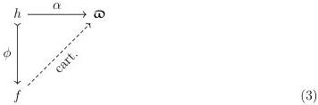
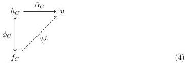

10

DANIEL GRATZER AND MICHAEL SHULMAN AND JONATHAN STERLING

The generic map $\mathfrak{m}$ satisfies a number of strict equations and, in particular, it satisfies (U8). The proof is similar to Lemma 2.1.2, but the additional indexing over $\mathcal{C}$ obscures this similarity. Accordingly, we introduce a small amount of machinery beforehand.

Observe first that we may view both $\mathsf{V}$ and $\widetilde{\mathsf{V}}$ as categories, respectively the categories of $\mathsf{V}$-sets and pointed $\mathsf{V}$-sets; this viewpoint is exposed in detail by Awodey, Gambino, and Hazratpour [AGH21, Section 1]. Given that both $\mathsf{V}$ and $\widetilde{\mathsf{V}}$ are small, we may view them as categories internal to $\mathbf{Set}$. For formal reasons, the projection $\mathbf{v}: \widetilde{\mathsf{V}} \longrightarrow \mathsf{V}$ is then a category internal to $\mathbf{Set}^{\rightarrow}$. From this perspective, each $\mathfrak{m}_C = \operatorname{Pr}_{\widetilde{\mathsf{V}}}(\mathcal{C}_{/C}) \longrightarrow \operatorname{Pr}_{\mathsf{V}}(\mathcal{C}_{/C}): \mathbf{Set}^{\rightarrow}$ (the component of the presheaf morphism $\mathfrak{m}$ at $C: \mathcal{C}$) is precisely the objects of the category $\mathbf{v}$-valued presheaves on $\mathbf{id}: \mathcal{C}_{/C} \longrightarrow \mathcal{C}_{/C}$ internal to $\mathbf{Set}^{\rightarrow}$.

Next, let $\alpha: f \longrightarrow \mathfrak{m}$ be a cartesian map in $\operatorname{Pr}(\mathcal{C})^{\rightarrow}$; there is a canonical cartesian map $\hat{\alpha}_C: f_C \longrightarrow \mathbf{v}$ in $\mathbf{Set}^{\rightarrow}$ defined like so:

$$\hat{\alpha}_C(x) = \alpha_C(x)(\mathbf{id}_C)$$

Returning to the perspective of $\mathbf{Set}^{\rightarrow}$, the element $\alpha_C(x)$ is a $\mathbf{v}$-valued presheaf on $\mathcal{C}_{/C}$, hence evaluating at $\mathbf{id}_C$ yields an element of $\mathbf{v}$.

### 2.2.4. THEOREM. The universe $\hat{\mathcal{S}}_{\mathsf{V}}$ satisfies realignment (U8).

PROOF. Fix a realignment problem of the following form in which $\phi$ and $\alpha$ are cartesian, and there exists some cartesian map $\chi: f \longrightarrow \mathfrak{m}$ that we wish to realign as the dotted lift depicted below:

For each $C: \mathcal{C}$, we transform the above into a realignment problem for the universe $\mathbf{v}: \widetilde{\mathsf{V}} \longrightarrow \mathsf{V}$ of sets in terms of the cartesian map $\hat{\alpha}_C: h_C \longrightarrow \mathbf{v}$. This yields a cartesian lift $\beta_C: f_C \longrightarrow \mathbf{v}$ in the following configuration.

The above is possible because $f_C$ is classified by $\mathbf{v}$. Hence we may define a natural transformation $\tilde{\beta}: f \longrightarrow \mathfrak{m}$ fitting into Diagram 3 as follows:

$$\tilde{\beta}_C(x)(z: D \longrightarrow C) = \beta_D(z \cdot x)$$