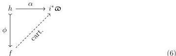
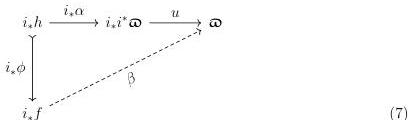

12

DANIEL GRATZER AND MICHAEL SHULMAN AND JONATHAN STERLING

### 2.3.4. THEOREM. *The class of maps $\tilde{S}_{\vee}$ is a universe satisfying (U1–6).*

It is natural to wonder whether this universe satisfies (U8), but unfortunately this does not seem to be the case. Fix a realignment problem in $\mathrm{Sh}(\mathcal{C})$:

By definition, $i_{*}f$ and $i_{*}h$ both belong to $\tilde{S}_{\vee}$. Moreover, since $i_{*}i^{*}\varpi \in \tilde{S}_{\vee}$ we obtain a cartesian morphism $u: i_{*}i^{*}\varpi \longrightarrow \varpi$ and so Diagram 6 induces a realignment problem in $\mathrm{Pr}(\mathcal{C})$ that can then be solved:

While this appears promising, there is no obvious way to relate this realignment problem in $\varpi$ to a solution in $i^{*}\varpi$. In particular, $i^{*}u$ is not the counit $\epsilon: i^{*}i_{*}i^{*}\varpi \longrightarrow i^{*}\varpi$ so $i^{*}\beta \circ \epsilon^{-1}$ does not satisfy the correct boundary condition.

Indeed, one can produce counterexamples to the claim. We are indebted to the reviewer who suggested the following counterexample.

### 2.3.5. LEMMA. *There exists a V-small site $(\mathcal{C}, J)$ such that $i^{*}\varpi$ does not satisfy (U8).*

PROOF. Define $\mathcal{C} = \{0 \leq 1\} \times \{0 \leq 1\}$ and let $J$ be such that $(0, 1)$, $(1, 0)$, and $(1, 1)$ have no non-trivial covers while $(0, 0)$ is covered by the empty sieve. The sheafification functor $i^{*}: \mathrm{Pr}(\mathcal{C}) \longrightarrow \mathrm{Sh}(\mathcal{C}, J)$ sends a presheaf $X: \mathcal{C}^{\mathrm{op}} \longrightarrow \mathbf{Set}$ to the following sheaf:

$$\begin{aligned} (i^{*}X)_{(0,0)} &= \mathbf{1} & (i^{*}X)_{(0,1)} &= X_{(0,1)} \\ (i^{*}X)_{(1,0)} &= X_{(1,0)} & (i^{*}X)_{(1,1)} &= X_{(1,1)} \end{aligned}$$

In particular, both $i^{*}\mathsf{U}_{0,1}$ and $i^{*}\mathsf{U}_{0,1}$ are isomorphic to $\mathrm{Ob}(\mathsf{V}^{\rightarrow})$. Let us consider the arrows $\mathbf{0} \longrightarrow \mathbf{1}$ and $\mathbf{1} \longrightarrow \mathbf{2}$ in $\mathsf{V}$ and write $f_{01}: \mathsf{y}(0,1) \longrightarrow \mathsf{U}$ for the map induced by the former and $f_{10}: \mathsf{y}(1,0) \longrightarrow \mathsf{U}$ for the map induced by the latter. We note that $f_{01}$ and $f_{10}$ classify $\mathbf{id}_{\mathsf{y}(0,1)}$ and $\mathbf{id}_{\mathsf{y}(1,0)}$, respectively.

Fix $P = \mathsf{y}(1,0) \amalg \mathsf{y}(0,1)$ and notice that $i^{*}P$ is the coproduct $i^{*}\mathsf{y}(0,1) \amalg i^{*}\mathsf{y}(1,0)$. We therefore amalgamate $i^{*}f_{01}$ and $i^{*}f_{10}$ into a single morphism:

$$f = i^{*}f_{01} \amalg i^{*}f_{10}: i^{*}P \longrightarrow i^{*}\mathsf{U}$$