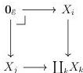

14

DANIEL GRATZER AND MICHAEL SHULMAN AND JONATHAN STERLING

amenable to such descent arguments since, in particular, pullback along $\coprod_i F(i) \longrightarrow \operatorname{colim}_F$ induces a suitable cartesian epimorphism.

We will often speak metonymically of a colimit having descent, to mean that the diagram of which it is the colimit has descent.

3.1.3. NOTATION. Write $\mathcal{E}_{\text{cart}} \subseteq \mathcal{E}^\to$ for the wide subcategory spanned by cartesian maps.

3.1.4. LEMMA. Let $J: \mathcal{D} \longrightarrow \mathcal{E}_{\text{cart}}$ be a diagram whose base $J_1: \mathcal{D} \longrightarrow \mathcal{E}$ satisfies descent in the sense of Definition 3.1.1. Then the colimit $\operatorname{colim}_{\mathcal{D}} J$ exists in $\mathcal{E}_{\text{cart}}$.

PROOF. We may first compute the colimit of $J$ in the ordinary arrow category $\mathcal{E}^\to$. Next we must show that each map $J(d) \longrightarrow \operatorname{colim}_{\mathcal{D}} J$ is cartesian, but this is exactly the content of $J_1$ enjoying descent. We must now check that the factorizations induced by the universal property of this colimit in $\mathcal{E}^\to$ are cartesian.

Fixing a cartesian natural transformation $h: J \longrightarrow \{X\}$, we must check that the induced map $h^\sharp: \operatorname{colim}_{\mathcal{D}} J \longrightarrow X$ is cartesian. We may cover $\operatorname{colim}_{\mathcal{D}} J$ by the coproduct $\coprod_{\mathcal{D}} J$; by the descent property of effective epimorphisms, it suffices to check that $\coprod_{\mathcal{D}} J \twoheadrightarrow \operatorname{colim}_{\mathcal{D}} J$ and $\coprod_{\mathcal{D}} J \longrightarrow X$ are both cartesian. To see that $\coprod_{\mathcal{D}} J \twoheadrightarrow \operatorname{colim}_{\mathcal{D}} J$ is cartesian, it suffices to recall that each $J(d) \longrightarrow \operatorname{colim}_{\mathcal{D}} J$ is cartesian by assumption. Likewise to check that $\coprod_{\mathcal{D}} J \longrightarrow X$ is cartesian, it suffices to recall our assumption that each component $h_d: J(d) \longrightarrow X$ is cartesian. ■

While all diagrams satisfy descent in an $\infty$-topos, only some diagrams in 1-topos theory have descent. The following classes of colimits do enjoy descent:

1. Coproducts enjoy descent: this is one phrasing of the traditional disjointness condition that for each $i \neq j$, the fiber product $X_i \times_{\coprod_k X_k} X_j$ is the initial object:

2. While pushouts do not generally enjoy descent (see Rezk [Rez10, Example 2.3] for a counterexample), pushouts along monomorphisms do enjoy descent; this property is commonly referred to as *adhesivity* [GL12b].
3. Filtered colimits enjoy descent.

The final condition (verified in Lemma 3.1.6) is a generalization of the *exhaustivity* condition identified by [Shu15].