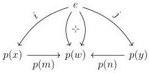
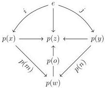
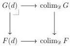

STRICT UNIVERSES FOR GROTHENDIECK TOPOI

15

PROOF. We must show that for any object $e \in \mathcal{D}$, the comma category $e \downarrow p$ is connected. Fixing $x, y \in {}^{d}/\mathcal{D}$ and $i: e \longrightarrow p(x)$ and $j: e \longrightarrow p(y)$, we must find a zig-zag of morphisms connecting $i$ to $j$ in $e \downarrow p$. Because ${}^{d}/\mathcal{D}$ is filtered, we may find $w \in {}^{d}/\mathcal{D}$ with $m: x \longrightarrow w$ and $n: y \longrightarrow w$. We have two triangles that cannot yet be pasted into a zig-zag:

Using the fact that $\mathcal{D}$ is filtered, we may find an arrow $p(w) \longrightarrow z$ that unites the two morphisms $e \longrightarrow p(w)$; because $w$ is under $d$ so is $z$, so in fact we have an arrow $o: w \longrightarrow z$ in ${}^{d}/\mathcal{D}$ with which we may complete the connection between $i$ and $j$:

Lemma 3.1.6 below is verified in greater generality by Garner and Lack [GL12a, Proposition 5.10]; we provide a direct proof for expository purposes.

3.1.6. LEMMA. Any filtered diagram $F: \mathcal{D} \longrightarrow \mathcal{E}$ enjoys descent.

PROOF. We fix a cartesian natural transformation $G \longrightarrow F$ and must check for each $d \in \mathcal{D}$ the following square is cartesian:

Because $\mathcal{D}$ is filtered, we may replace the indexing category with the coslice ${}^{d}/\mathcal{D}$ by