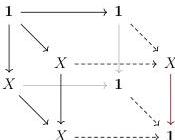
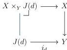

STRICT UNIVERSES FOR GROTHENDIECK TOPOI

19

3.2.4. DEFINITION. A category $\mathcal{C}$ is locally $\kappa$-presentable when $\mathcal{C}$ is cocomplete and there is a set of $\kappa$-compact objects that generates $\mathcal{C}$ under $\kappa$-filtered colimits.

3.2.5. NOTATION. As a Grothendieck topos, $\mathcal{E}$ is locally $\kappa$-presentable for some regular cardinal $\kappa$. For the remainder of this subsection, we fix $\kappa$ to be such a cardinal.

The colimit of a diagram in $\mathcal{E}^\rightarrow$ of relatively $\kappa$-compact morphisms is not necessarily relatively $\kappa$-compact. For a simple counterexample, consider an object $X$ that is *not* $\kappa$-compact; then the following pushout of relatively $\kappa$-compact morphisms is not relatively $\kappa$-compact:

More can be said when the diagram is cartesian (*i.e.* valued in $\mathcal{E}_{cart}^\rightarrow$). In particular, relatively $\kappa$-compact morphisms are closed under colimits of cartesian diagrams whose bases satisfy descent in the sense of Definition 3.1.1, which we verify in Lemma 3.2.7. We first recall Proposition 4.18 of Shulman [Shu19].

3.2.6. PROPOSITION. Let $J: \mathcal{D} \rightarrow \mathcal{E}$ be a diagram and let $Y$ be its colimit; a morphism $X \rightarrow Y$ is relatively $\kappa$-compact if and only if for each $d \in \mathcal{D}$, the pullback $X \times_Y J(d) \rightarrow J(d)$ depicted below is relatively $\kappa$-compact:

PROOF. The only if direction is clear, so suppose for each $d \in \mathcal{D}$, $X \times_Y J(d) \rightarrow J(d)$ is relatively $\kappa$-compact. We must show that $X \rightarrow Y$ is relatively $\kappa$-compact. Recall that any diagram can be presented as a $\kappa$-filtered diagram of colimits of $\kappa$-small sub-diagrams [Mac98, Theorem IX.1.1]. Therefore, it suffices to show that this holds when $J$ is $\kappa$-filtered and when $J$ is $\kappa$-small.

First suppose $J$ is $\kappa$-filtered. Fix a $\kappa$-compact object $Z$ together with a morphism $Z \rightarrow Y$, we must show that the pullback $Z \times_Y X$ is $\kappa$-compact. As $Y$ is the colimit of a