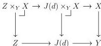
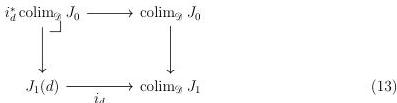

20

DANIEL GRATZER AND MICHAEL SHULMAN AND JONATHAN STERLING

$\kappa$-filtered diagram, the morphism $Z \longrightarrow Y$ must factor through some $J(d) \longrightarrow Y$:

By assumption, $J(d) \times_Y X \longrightarrow J(d)$ is relatively $\kappa$-compact so $Z \times_Y X$ is $\kappa$-compact.

Next, suppose that $J$ is a $\kappa$-small diagram. In this case, the diagram category $\mathcal{E}^\mathcal{D}$ is also locally $\kappa$-presentable [AR94, Corollary 1.54]. Accordingly, $D = \operatorname{colim}_{i \in \mathcal{I}} E_i$, where each $E_i$ is a $\kappa$-compact object in $\mathcal{E}^\mathcal{D}$ and $\mathcal{I}$ is $\kappa$-filtered. Each $E_i(d)$ is $\kappa$-compact [Shu19, Lemma 4.2] and by commutation of colimits $Y = \operatorname{colim}_{i \in \mathcal{I}} \operatorname{colim}_{d \in \mathcal{D}} E_i(d)$.

By assumption $\mathcal{I}$ is $\kappa$-filtered so by the already proven case it suffices to show that $X \times_Y \operatorname{colim}_d E_i(d) \longrightarrow \operatorname{colim}_d E_i(d)$ is relatively $\kappa$-compact for each $i \in \mathcal{I}$. As the $\kappa$-small colimit of $\kappa$-small objects, $\operatorname{colim}_d E_i(d)$ is $\kappa$-compact so this morphism is relatively $\kappa$-compact if and only if $X \times_Y \operatorname{colim}_d E_i(d)$ is $\kappa$-compact. By universality of colimits, we have a sequence of identifications:

$$X \times_Y \operatorname{colim}_d E_i(d) = \operatorname{colim}_d X \times_Y E_i(d) = \operatorname{colim}_d((X \times_Y J(d)) \times_{J(d)} E_i(d))$$

Thus, this object is $\kappa$-compact as the $\kappa$-small colimit of $\kappa$-compact objects. ■

3.2.7. LEMMA. The colimit of a diagram $J: \mathcal{D} \longrightarrow \mathcal{E}_{\text{cart}}^\rightarrow$ of relatively $\kappa$-compact morphisms is relatively $\kappa$-compact if the base $J_1: \mathcal{D} \longrightarrow \mathcal{E}$ satisfies descent in the sense of Definition 3.1.1.

PROOF. By Proposition 3.2.6 it suffices to check that each fiber $i_d^* \operatorname{colim}_\mathcal{D} J_0: \mathcal{E}^\rightarrow$ below is relatively $\kappa$-compact:

Because $J_1$ satisfies descent, the cartesian square depicted in Diagram 13 is actually $J(d) \longrightarrow \operatorname{colim}_\mathcal{D} J$; but we have already assumed that $J(d)$ is relatively $\kappa$-compact. ■

3.2.8. LEMMA. The class of maps $\mathcal{S}_\kappa$ satisfies the descent axiom (U7).