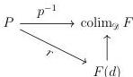
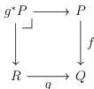

22

DANIEL GRATZER AND MICHAEL SHULMAN AND JONATHAN STERLING

As $P$ is $\kappa$-compact, we obtain a map $r: P \longrightarrow F(d)$ for some $d: \mathcal{D}$ fitting into the following diagram:

It follows immediately that $r$ is monic, and so $P$ is a subobject of $F(d)$. As $F(d)$ is valued in $\kappa$-small sets, so is $P$.

3.3.2. LEMMA. *For any $\kappa > |\mathcal{C}|$, a morphism $f: P \longrightarrow Q$ is relatively $\kappa$-compact in $\Pr(\mathcal{C})$ if and only if the fibers of $f$ over representable presheaves are $\kappa$-compact.*

PROOF. The only-if direction is immediate, so it suffices to show that $f$ is relatively compact provided that its fibers over representable presheaves are compact. To this end, fix a $\kappa$-compact presheaf $R$ and a morphism $g: R \longrightarrow Q$:

We must show that $g^*P$ is $\kappa$-compact. Viewing $R$ as a colimit of representables, universality ensures that $g^*P = \text{colim}_{(C,r) \in \text{Elt}(R)} f^*\mathbf{y}(C)$. By assumption, each $f^*\mathbf{y}(C)$ is $\kappa$-compact, and by Lemma 3.3.1 $\text{Elt}(R)$ is a $\kappa$-small category. Accordingly, as a $\kappa$-small colimit of $\kappa$-compact objects, $g^*P$ is $\kappa$-compact.

For the next sequence of results, we shall require some results from the theory of accessible categories and accessible functors. In order to state them, we require a small amount of set-theoretic bureaucracy in the form of the $\triangleright$ relation:

3.3.3. DEFINITION. *A cardinal $\lambda > \kappa$ is sharply larger than $\kappa$, notated $\lambda \triangleright \kappa$, if each $\kappa$-accessible category is $\lambda$-accessible.*

We emphasize that $\lambda \triangleright \kappa$ is not the same as $\lambda > \kappa$ nor does it mean anything akin to “$\lambda$ is much larger than $\kappa$”. We refer the reader to Adámek and Rosický [AR94, Theorem 2.11] for more information about $\triangleright$. For our purposes it suffices to know that if $\lambda$ is strongly inaccessible then $\kappa < \lambda$ is equivalent to $\kappa \triangleleft \lambda$.

3.3.4. LEMMA. *There exists a cardinal $\lambda_0$ such that for any $\lambda \triangleright \lambda_0$, both $i_*$ and $i^*$ preserve $\lambda$-filtered colimits and $\lambda$-compact objects.*

PROOF. As adjoints $i_*$ and $i^*$ are both accessible functors. Therefore, the result follows immediately from the uniformization result (2.19) of Adámek and Rosický [AR94].