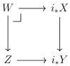
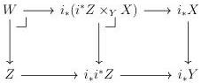

STRICT UNIVERSES FOR GROTHENDIECK TOPOI

23

3.3.5. LEMMA. If $i^*$ preserves $\lambda$-compact objects, then $i_*$ reflects them.

PROOF. Let $E \in \operatorname{Sh}(\mathcal{C}, J)$ be such that $i_*E$ is $\lambda$-compact; because $i^*$ preserves $\lambda$-compact objects, $i^*i_*E \cong E$ is $\lambda$-compact.

Combining the above result with the characterization of $\kappa$-compact objects given by Lemma 3.3.1, we deduce the following.

3.3.6. COROLLARY. Given a regular cardinal $\lambda$ sharply larger than both $\lambda_0$ and $|\mathcal{C}|$, the following properties hold:

1. $\mathcal{E}$ is locally $\lambda$-presentable.
2. The $\lambda$-compact objects in $\mathcal{E}$ are closed under finite limits.

If $\lambda$ is further assumed to be strongly inaccessible, then we additionally have:

3. The set $\operatorname{Hom}_{\mathcal{E}}(X, Y)$ between two $\lambda$-compact objects $X, Y$ is $\lambda$-small.

3.3.7. LEMMA. Given a regular cardinal $\lambda$ sharply larger than both $\lambda_0$ and $|\mathcal{C}|$, the direct image functor $i_*$ preserves and reflects relatively $\lambda$-compact morphisms.

PROOF. We handle preservation and reflection separately.

Preservation. Let $X \longrightarrow Y$ be a relatively $\lambda$-compact morphism in $\mathcal{E}$. We must check that $i_*X \longrightarrow i_*Y$ is relatively $\lambda$-compact. Fixing a $\lambda$-compact object $Z \in \operatorname{Pr}(\mathcal{C})$ along with a map $Z \longrightarrow i_*Y$, it suffices to argue that the fiber product $W = Z \times_{i_*Y} i_*X$ is $\lambda$-compact:

Observe that $Z \longrightarrow i_*Y$ factors uniquely through $\eta_Z: Z \longrightarrow i_*i^*Z$. As $i_*$ preserves cartesian squares, we can factor the above cartesian square as follows:

Recalling that $i^*$ preserves $\lambda$-compact objects (Lemma 3.3.4), $i^*Z$ is $\lambda$-compact and consequently so too is $i^*Z \times_Y X$. By Lemma 3.3.4 again, both $i_*i^*Z$ and $i_*(i^*Z \times_Y X)$ are $\lambda$-compact. Finally, $W$ is $\lambda$-compact as the finite limit of $\lambda$-compact objects (Corollary 3.3.6).