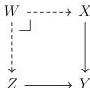
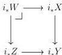

24

DANIEL GRATZER AND MICHAEL SHULMAN AND JONATHAN STERLING

*Reflection.* Let $X \rightarrow Y$ be a morphism in $\mathcal{E}$ such $i_*X \rightarrow i_*Y$ is relatively $\lambda$-compact in $\Pr(\mathcal{C})$. Fixing a morphism $Z \rightarrow Y$ with $Z$ a $\lambda$-compact object, we must check that the fiber product $W$ below is $\lambda$-compact:

The right adjoint $i_*$ preserves $\lambda$-compact objects by assumption (Lemma 3.3.4) and hence $i_*Z$ is $\lambda$-compact; because $i_*$ also preserves pullbacks, we deduce that $i_*W$ is a $\lambda$-compact object in $\Pr(\mathcal{C})$:

Finally, Lemma 3.3.5 implies $W$ is $\lambda$-compact. ■

3.3.8. REMARK. The proof of Lemma 3.3.7 establishes a more general result: a right adjoint $G: \mathcal{C} \rightarrow \mathcal{D}$ between finitely complete categories preserves relatively $\kappa$-compact families provided both adjoints preserve $\kappa$-compact objects and $\kappa$-compact objects in $\mathcal{D}$ are closed under finite limits. If $G$ is additionally assumed to reflect $\kappa$-compact objects, it reflects $\kappa$-compact families.

Combining the above results with Theorem 2.3.4, we obtain the following result:

3.3.9. THEOREM. *There exists a cardinal $\kappa$ such that for any strongly inaccessible $\lambda \triangleright \kappa$, $\mathcal{E}$ is locally $\lambda$-presentable and the class of relatively $\lambda$-compact maps in $\mathcal{E}$ form a universe $\mathcal{S}_\lambda$ satisfying (U1–7) and $\lambda$-compact objects are closed under finite limits.*

PROOF. We define $\kappa$ to be any regular cardinal sharply larger than both $\lambda_0$ and $|\mathcal{C}|$. We first recall that $\mathcal{E}$ is locally $\lambda$-presentable and that $\lambda$-compact objects are closed under finite limits by Corollary 3.3.6. Next, Theorem 2.3.4 combined with Lemmas 3.3.1, 3.3.2 and 3.3.7 ensures that for any $\lambda \triangleright \kappa$, the universe $\mathcal{S}_\lambda$ satisfies (U1–6). Finally, we have established that $\mathcal{S}_\lambda$ satisfies (U7) in Lemma 3.2.8. ■

3.3.10. DEFINITION. *We write $\mathfrak{c}(\mathcal{E})$ for the cardinal $\kappa$ provided by Theorem 3.3.9.*

3.3.11. COROLLARY. *For any strongly inaccessible $\lambda \triangleright \mathfrak{c}(\mathcal{E})$, the full subcategory of $\mathcal{E}/Y$ spanned by relatively $\lambda$-compact maps is essentially small.*

PROOF. Writing $\mathfrak{w}_\lambda: \tilde{\mathrm{U}}_\lambda \rightarrow \mathrm{U}_\lambda$ for the generic map of $\mathcal{S}_\lambda$, this subcategory of $\mathcal{E}/Y$ is bounded by $\mathrm{Hom}(Y, \mathrm{U}_\lambda)$. ■