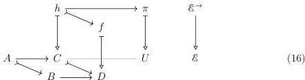
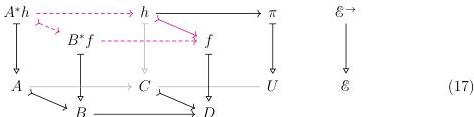
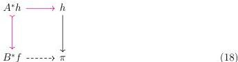

26

DANIEL GRATZER AND MICHAEL SHULMAN AND JONATHAN STERLING

We must show that $C \rightharpoonup D \in \mathcal{J}_{\pi}$; to that end, we fix a realignment problem $f \longleftarrow h \longrightarrow \pi$ whose extent lies over $C \rightharpoonup D$.

We will transform the realignment problem of Diagram 16 into one that we can already solve; first we fill in the cartesian lifts over the pushout square in the base.

By the universality of colimits, the upper face is a pushout; therefore to solve our realignment problem, it suffices to find a map $B^*f \longrightarrow \pi$ making the following square commute:

Because $\mathcal{S}$ is stable under pullback, we have $B^*f \in \mathcal{S}$; therefore Diagram 18 is itself a realignment problem whose extent lies over an element of $\mathcal{J}_{\pi}$.

4.1.3. NOTATION. We will write $\mathcal{O}_{<\alpha}$ for the filtered poset of ordinal numbers $\beta < \alpha$.
4.1.4. LEMMA. The class of realignable monomorphisms $\mathcal{J}_{\pi}$ is stable under transfinite composition.

PROOF. Let $F: \mathcal{O}_{<\alpha} \longrightarrow \mathcal{E}$ be a cocontinuous functor such that each $F(\beta) \longrightarrow F(\beta + 1)$ is an element of $\mathcal{J}_{\pi}$. We must show that the transfinite composition $F(0) \longrightarrow \operatorname{colim}_{\mathcal{O}_{<\alpha}} F$ is an ele-