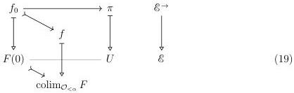
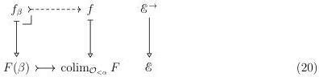
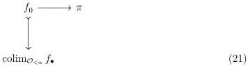
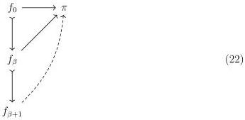

STRICT UNIVERSES FOR GROTHENDIECK TOPOI

27

ment of $\mathcal{J}_{\pi}$. We fix a realignment situation whose extent lies over some $F(0) \mapsto \operatorname{colim}_{\mathcal{O}_{<\alpha}} F$:

By the universality of colimits, we may replace $f$ with $\operatorname{colim}_{\mathcal{O}_{<\alpha}} f_{\bullet}$ where we define $f_{\bullet}: \mathcal{O}_{<\alpha} \longrightarrow \mathcal{E}_{cart}^{\rightarrow}$ to extend $f_0$ by sending each $f_{\beta}$ to the following cartesian lift:

Our realignment problem can therefore be rewritten as follows:

We will define the natural transformation $\operatorname{colim}_{\mathcal{O}_{<\alpha}} f_{\bullet} \longrightarrow \pi$ by transfinite induction on $\beta \leq \alpha$. In the zero case, we use our existing map $f_0 \longrightarrow \pi$. In the successor case, we assume a map $f_{\beta} \longrightarrow \pi$ extending $f_0 \mapsto f_{\beta}$ and glue $f_{\beta} \longrightarrow \pi$ along $f_{\beta} \mapsto f_{\beta+1} \in \mathcal{J}_{\pi}$:

The limit case is trivial, as we may assemble all the prior solutions into a single one