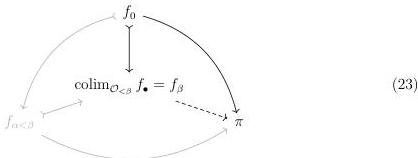
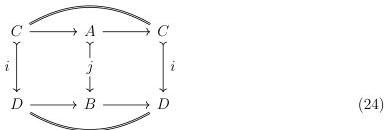
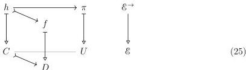
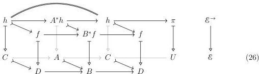

28

DANIEL GRATZER AND MICHAEL SHULMAN AND JONATHAN STERLING

using the universal property of $f_\beta$ as $\operatorname{colim}_{\mathcal{O}_{<\beta}} f_\bullet$:

We note that $\operatorname{colim}_{\mathcal{O}_{<\beta}} f_\bullet \longrightarrow \pi$ remains cartesian by the universality of colimits.

The extension to Diagram 23 remains natural because we have merely combined the solutions to the smaller realignment problems. ■

4.1.5. LEMMA. *The class of realignable monomorphisms $\mathcal{J}_\pi$ is closed under retracts.*

PROOF. We fix $j: A \rightharpoonup B \in \mathcal{J}_\pi$ and a retract $i: C \rightharpoonup D$ of $j$ in $\mathcal{E}^\to$:

To check that $i \in \mathcal{J}_\pi$, we fix a realignment problem whose extent lies over $i: C \rightharpoonup D$:

We restrict Diagram 25 along Diagram 24:

