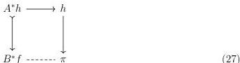
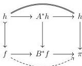

STRICT UNIVERSES FOR GROTHENDIECK TOPOI

29

We first glue $A^*h \longrightarrow \pi$ along $A^*h \succ B^*f$ which lies over $j \in \mathcal{J}_\pi$:

The dotted map of Diagram 27 restricts along the left-most square of $f \longrightarrow B^*f$ to a solution to our original realignment problem (Diagram 25):

4.2. A SMALL OBJECT ARGUMENT. In this section we construct a candidate for the generic family of $\mathcal{S}_\kappa$, using a variant of the small object argument. Our construction is very similar to that of Shulman [Shu15; Shu19] but relies on different assumptions.

By Lemma 3.3.12, there is a $\kappa$-small set of monomorphisms $\mathcal{I} \subseteq \mathcal{E}^-$ generating all the monomorphisms of $\mathcal{E}$ under pushout, transfinite composition, and retracts, and whose domains and codomains are $\kappa$-compact.

4.2.1. DEFINITION. Let $\pi: E \longrightarrow U$ be a relatively $\kappa$-compact map. A realignment datum for $\pi$ is defined to be a relatively $\kappa$-compact map $f$ together with a span of the following form in $\mathcal{E}_{\text{cart}}$, in which $h \succ f$ lies horizontally over an element of $\mathcal{I}$:

$$f \longleftarrow h \longrightarrow \pi$$

There is of course a proper class of realignment data in the sense of Definition 4.2.1, but Corollary 3.3.11 ensures that up to isomorphism there is only a set of realignment data.

4.2.2. NOTATION. We will write $\mathsf{D}_\kappa(\pi)$ for the chosen set of representatives of isomorphism classes of realignment data for $\pi$; for any $d \in \mathsf{D}_\kappa(\pi)$, we will write $f_d \longleftarrow h_d \longrightarrow \pi$ for the span it represents.

We record the following lemma for use in Section 4.4.

4.2.3. LEMMA. Given a strongly inaccessible cardinal $\mu > \kappa$ and a relatively $\kappa$-compact morphism $\pi: E \longrightarrow U$ such that $U$ is $\mu$-compact, the set $\mathsf{D}_\kappa(\pi)$ is $\mu$-small.

PROOF. Given $A \succ B \in \mathcal{I}$, there is a $\mu$-small set of morphisms $B \longrightarrow U$ by Corollary 3.3.6. As $\mathcal{I}$ is $\kappa$-small, the conclusion then follows.