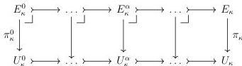
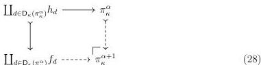

30

DANIEL GRATZER AND MICHAEL SHULMAN AND JONATHAN STERLING

4.2.4. CONSTRUCTION. We will define an ideal diagram $\pi_\kappa^\bullet: \mathcal{O}_{<\kappa} \longrightarrow \mathcal{E}_{cart}^\rightarrow$ by well-founded induction, finally defining the family $\pi_\kappa: \mathcal{E}_{cart}^\rightarrow$ to be $\operatorname{colim}_{\mathcal{O}_{<\kappa}} \pi_\kappa^\bullet$:

We initialize the iteration by setting $\pi_\kappa^0 := \mathbf{0}_{\mathcal{E}_{cart}^\rightarrow}$. In the successor case, we assume $\pi_\kappa^\alpha \in \mathcal{E}_{cart}^\rightarrow$ and define $\pi_\kappa^{\alpha+1}$ to be the following pushout computed in $\mathcal{E}_{cart}^\rightarrow$ using Lemma 3.1.4.

At a limit ordinal $\alpha$, fix an ideal diagram $\pi_\kappa^\bullet: \mathcal{O}_{<\alpha} \longrightarrow \mathcal{E}_{cart}^\rightarrow$ and define $\pi_\kappa^\alpha := \operatorname{colim}_{\mathcal{O}_{<\alpha}} \pi_\kappa^\bullet$.

4.2.5. LEMMA. *The ideal diagram $\pi_\kappa^\bullet: \mathcal{O}_{<\kappa} \longrightarrow \mathcal{E}_{cart}^\rightarrow$ from Construction 4.2.4 is valued in relatively $\kappa$-compact morphisms.*

PROOF. We proceed by induction on ordinals $\alpha \leq \kappa$. The base case $\pi_\kappa^0 = \mathbf{0}_{\mathcal{E}_{cart}^\rightarrow}$ is relatively $\kappa$-compact by Lemma 3.2.7. Next we check that $\pi_\kappa^{\alpha+1}$ is relatively $\kappa$-compact assuming $\pi_\kappa^\alpha$ is relatively $\kappa$-compact. We may apply Lemma 3.2.7 because Diagram 28 enjoys descent as a pushout along a monomorphism, so it suffices to check that each node of Diagram 28 is relatively $\kappa$-compact. We have already assumed that $\pi_\kappa^\alpha$ is relatively $\kappa$-compact; both $\coprod_{d \in \mathsf{D}_\kappa(\pi_\kappa^\alpha)} f_d$ and $\coprod_{d \in \mathsf{D}_\kappa(\pi_\kappa^\alpha)} h_d$ are relatively $\kappa$-compact again by Lemma 3.2.7 because coproducts enjoy descent and both $f_d, h_d$ are relatively $\kappa$-compact as pullbacks of $\pi_\kappa^\alpha$. In the limit case we assume $\pi_\kappa^\beta$ relatively $\kappa$-compact for each $\beta < \alpha$, and observe that $\operatorname{colim}_{\mathcal{O}_{<\alpha}} \pi_\kappa^\bullet$ is relatively $\kappa$-compact by Lemma 3.2.7 again, since $\mathcal{O}_{<\alpha}$ is a filtered preorder and therefore its diagrams enjoy descent (Lemma 3.1.6).

4.2.6. LEMMA. *The transfinite composition $\pi_\kappa := \operatorname{colim}_{\mathcal{O}_{<\kappa}} \pi_\kappa^\bullet$ is relatively $\kappa$-compact.*

PROOF. By Lemmas 3.2.7 and 4.2.5 using the fact that transfinite compositions enjoy descent (Lemma 3.1.6).

4.3. REALIGNMENT FOR THE UNIVERSE. In Section 4.2 we have constructed a relatively $\kappa$-compact map $\pi_\kappa: E_\kappa \longrightarrow U_\kappa$ using the small object argument. We wish to show that this map exhibits $\mathcal{S}_\kappa$ as a universe satisfying (U5,8), *i.e.* $\pi_\kappa$ is generic for relatively $\kappa$-compact maps and satisfies the realignment condition. Because realignment is stronger than genericity (Lemma 1.1.7), we will focus on the former.

We recall from Notation 4.1.1 that $\mathcal{J}_{\pi_\kappa}$ denotes the largest class of monomorphisms relative to which $(\mathcal{S}, \pi_\kappa)$ supports realignment. From Lemma 3.3.12 we recall that $\mathcal{I}$ is a