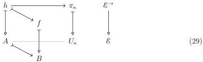
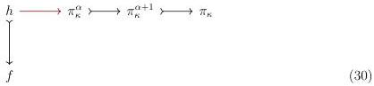
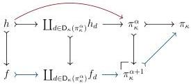

STRICT UNIVERSES FOR GROTHENDIECK TOPOI

31

set of monomorphisms generating $\mathcal{E}$ under pushout, transfinite composition, and retracts, and we have assumed that the domain of any $m \in \mathcal{I}$ is $\kappa$-compact.

4.3.1. LEMMA. Every generating monomorphism is realignable, i.e. we have $\mathcal{I} \subseteq \mathcal{J}_{\pi}$.

PROOF. Let $i: A \mapsto B$ be an element of $\mathcal{I}$; to check that $i \in \mathcal{J}_{\pi_{\kappa}}$, we fix a realignment problem in $\mathcal{S}_{\kappa}$ whose extent lies over $i: A \mapsto B$.

Because $A \mapsto B \in \mathcal{I}$, we know that $A$ is $\kappa$-compact; this is the same as to say that $\operatorname{Hom}_{\mathcal{E}}(A, -)$ commutes with $\kappa$-filtered colimits, in particular the colimit $U_{\kappa} = \operatorname{colim}_{\mathcal{O}_{<\kappa}} U_{\kappa}^{\bullet}$. Thus, using the construction of colimits in the category of sets, there exists some $\alpha$ such that $h \to \pi_{\kappa}$ factors through $\pi_{\kappa}^{\alpha} \mapsto \pi_{\kappa}$; the successor case of the small object argument adjoins realignments along generating monomorphisms, so it is appropriate to factor our realignment problem like so:

The intermediate realignment span $f \longleftrightarrow h \longrightarrow \pi_{\kappa}^{\alpha}$ can be represented by a realignment datum $d \in \mathsf{D}_{\kappa}(\pi_{\kappa}^{\alpha})$. We may therefore compose the induced injections to obtain a solution $f \longrightarrow \pi_{\kappa}$ to the realignment problem Diagram 29.

4.3.2. COROLLARY. All monomorphisms are realignable, i.e. we have $\mathcal{J}_{\pi_{\kappa}} = \mathcal{E}^{\rightarrow}$.

PROOF. We have assumed that $\mathcal{I}$ generates $\mathcal{E}^{\rightarrow}$ under pushout, transfinite composition, and retracts; but $\mathcal{J}_{\pi_{\kappa}}$ is saturated (Section 4.1), so our result follows from the fact that generating monomorphisms are realignable (Lemma 4.3.1).