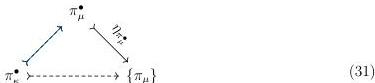
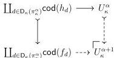

32

DANIEL GRATZER AND MICHAEL SHULMAN AND JONATHAN STERLING

4.3.3. COROLLARY. $S_\kappa$ is a universe satisfying (U1-8).

4.4. A CUMULATIVE UNIVERSE HIERARCHY. Fix a second strongly inaccessible cardinal $\mu > \kappa$. We obtain a generic map $\pi_\mu$ for $S_\mu$ satisfying (U8) by the same small object argument detailed in Section 4.2.

Genericity of $\pi_\mu$ implies that we automatically obtain a cartesian morphism $\pi_\kappa \longrightarrow \pi_\mu$ but this map is not generally a monomorphism. On the other hand, we can choose our own cartesian monomorphism $\pi_\kappa \longmapsto \pi_\mu$ by means of a pointwise construction.

4.4.1. LEMMA. There exists a cartesian monomorphism $\pi_\kappa \longmapsto \pi_\mu$.

PROOF. We recall that each $\pi_\lambda$ is $\operatorname{colim}_{\mathcal{O}_{<\kappa}} \pi_\lambda^\bullet$. Because filtered colimits enjoy descent, by Lemma 3.1.10 to construct a cartesian monomorphism $\operatorname{colim}_{\mathcal{O}_{<\kappa}} \pi_\kappa^\bullet \longmapsto \operatorname{colim}_{\mathcal{O}_{<\kappa}} \pi_\mu^\bullet$, it suffices to define a cartesian monomorphism of diagrams $\ell: \pi_\kappa^\bullet \longmapsto \pi_\mu^\bullet$:

We construct our natural transformation $\pi_\kappa^\bullet \longmapsto \pi_\mu^\bullet$ step-wise; the only interesting case is to define $\pi_\kappa^{\alpha+1} \longmapsto \pi_\mu^{\alpha+1}$ given $\pi_\kappa^\alpha \longmapsto \pi_\mu^\alpha$. By Lemma 3.1.10 it suffices to define a cartesian monomorphism between the defining spans of $\pi_\kappa^{\alpha+1}, \pi_\mu^{\alpha+1}$, since they are pushouts along monomorphisms and hence enjoy descent in $\mathcal{E}^\to$. Such a morphism is trivially induced by the embedding that sends a realignment span $f \longleftarrow h \longrightarrow \pi_\kappa^\alpha$ to $f \longleftarrow h \longrightarrow \pi_\kappa^{\alpha+1}$ by postcomposition with $\pi_\kappa^\alpha \longmapsto \pi_\kappa^{\alpha+1}$.

4.4.2. LEMMA. $U_\kappa$ is $\mu$-compact.

PROOF. We argue that $U_\kappa$ is $\mu$-compact by showing that it is the $\mu$-small colimit of $\mu$-small objects. Recall that $U_\kappa = \operatorname{colim}_{\mathcal{O}_{<\kappa}} U_\kappa^\bullet$, so it suffices to argue that $U_\kappa^\alpha$ is $\mu$-compact for each $\alpha < \kappa$.

We show this by transfinite induction on $\alpha < \kappa$. The limit case is immediate: $U_\kappa^\alpha$ is then a $\mu$-small colimit of $\mu$-compact objects. Fix $\alpha < \kappa$ and assume that $U_\kappa^\alpha$ is $\mu$-small. $U_\kappa^{\alpha+1}$ is defined as the following pushout:

By Lemmas 3.3.12 and 4.2.3 together with our assumption that $U_\kappa^\alpha$ is $\mu$-compact, this is a $\mu$-small colimit of $\mu$-compact objects so $U_\kappa^{\alpha+1}$ is $\mu$-compact.