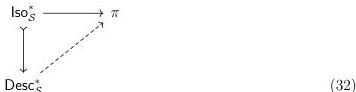
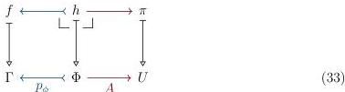
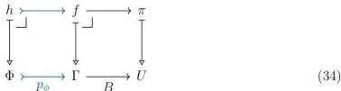

34

DANIEL GRATZER AND MICHAEL SHULMAN AND JONATHAN STERLING

5.1.4. NOTATION. We will write $\mathsf{Iso}_S^* : \mathcal{E}_{/\mathsf{Iso}_S}$ for the dependent type $I : \mathsf{Iso}_S \vdash \pi_1(I)$ of pointed isomorphisms. We define the type $\mathsf{Desc}_S$ of $S$-realignment data to be the dependent sum $\sum_{B:U} \mathsf{Iso}_S(B)^+$. We will write $\mathsf{Desc}_S^* : \mathcal{E}_{/\mathsf{Desc}_S}$ for the dependent type $D : \mathsf{Desc}_S \vdash \pi_1(D)$ of pointed realignment data.

5.1.5. LEMMA. Let $S$ be a universe satisfying (U8) for the class of all monomorphisms; then $S$ has a realignment structure.

PROOF. We have a cartesian monomorphism $\mathsf{Iso}_S^* \hookrightarrow \mathsf{Desc}_S^*$ that turns an isomorphism into the corresponding total realignment datum with $\phi := \top$. Taking the domain of an isomorphism corresponds to a cartesian map $\mathsf{Iso}_S^* \to \pi$. Combining these, we may rephrase Definition 5.1.3 as the existence of a cartesian morphism $\mathsf{Desc}_S^* \to \pi$ in the following configuration:

The dotted map of Diagram 32 exists by the realignment axiom because $\mathsf{Desc}_S^* \in S$. ■

5.1.6. LEMMA. Suppose that $S$ has a realignment structure; then $S$ satisfies (U8) for the class of all monomorphisms.

PROOF. We transform external realignment problems into internal ones. Fix a span of cartesian maps as below such that $f \in S$:

Because $f \in S$, we additionally have:

