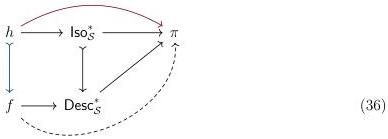
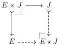

STRICT UNIVERSES FOR GROTHENDIECK TOPOI

35

We take the characteristic map of \(\Phi\):

\[
\begin{array}{c} \Phi \longrightarrow \mathbf {1} _ {\varepsilon} \\ p _ {\phi} \Biggl \downarrow \quad \Biggl \downarrow \quad \Biggl \downarrow \quad \Biggl \downarrow \quad \Biggl \downarrow \quad \Biggl \uparrow \\ \Gamma \xrightarrow [ \phi ]{} \Omega \end{array} \tag {35}
\]

We have a map \(\Phi \longrightarrow \mathsf{Iso}_S(B \circ p_\phi)\) determined by \(A\), which we observe forms the base of a cartesian map \(h \longrightarrow \mathsf{Iso}_S^*\). On the other hand, we have a map \(\Gamma \longrightarrow \mathsf{Iso}_S(B)^+\), i.e. a partial isomorphism with support \(\phi\) between \(A\) and \(B \circ p_\phi\). Therefore we have a realignment datum \(\Gamma \longrightarrow \mathsf{Desc}_S\) determined by \(B\) and our partial isomorphism; in fact, this is the base of a cartesian map \(f \longrightarrow \mathsf{Desc}_S^*\) which we may compose with the realignment structure to obtain the desired factorization:

In short, we solved the realignment problem by restricting from the generic case.

5.2. REALIGNMENT AND RECOLLEMENT. Sterling has recently advanced an alternative [SH22] to the internal characterization of Orton and Pitts (Section 5.1) based on the recollement of a sheaf from its components over complementary open and closed subspaces. We recall the basics of the theory from SGA 4 [AGV72].

When \(\mathcal{X}\) is a topos, a subterminal object \(J\mapsto\mathbf{1}_{\mathcal{X}}\) corresponds to an open subtopos \(\mathcal{X}_{/J}\) such that the open inclusion geometric morphism \(j_{*}:\mathcal{X}_{/J}\hookrightarrow\mathcal{X}\) is the right adjoint to the pullback functor \(j^{*}:\mathcal{X}\longrightarrow\mathcal{X}_{/J}\) that sends \(E\) to \(E\times J\longrightarrow J\). Meanwhile we may form the complementary closed subtopos \(\mathcal{X}_{\star U}=\mathcal{X}\setminus\mathcal{X}_{/J}\) by considering the subcategory of \(\mathcal{X}\) spanned by objects \(E\) for which the canonical map \(E\times J\longrightarrow J\) is an isomorphism. The closed inclusion \(i_{*}:\mathcal{X}_{\star J}\hookrightarrow\mathcal{X}\) then has a left exact left adjoint \(i^{*}:\mathcal{X}\longrightarrow\mathcal{X}_{\star J}\) taking \(E\) to the join \(E\star J\), i.e. the following pushout:

