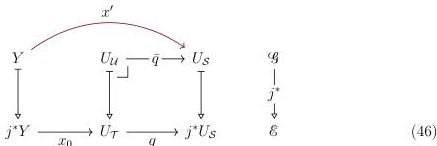
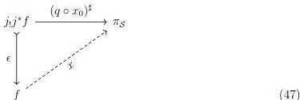

46

DANIEL GRATZER AND MICHAEL SHULMAN AND JONATHAN STERLING

6.3.5. AN ABORTIVE ATTEMPT AT GENERICITY. Prior to verifying that Construction 6.3.4 gives rise to a generic family for $\mathcal{U}$ under the assumption of realignment for $\mathcal{S}$ in Section 6.3.6 below, it is useful to understand intuitively why realignment is needed. Fixing a morphism $f: X \longrightarrow Y \in \mathcal{U}$, we wish to construct a cartesian map $f \longrightarrow \pi_{\mathcal{U}}$. By definition, we have $f \in \mathcal{S}$ and $j^*f \in \mathcal{T}$, hence there exist a pair of cartesian morphisms $x': f \longrightarrow \pi_{\mathcal{S}}$ and $x_0: j^*f \longrightarrow \pi_{\mathcal{T}}$. Naively, we might hope to take advantage of the universal property of $U_{\mathcal{U}}$ *qua* cartesian lift to obtain a cartesian map $f \longrightarrow \pi_{\mathcal{U}}$:

Unfortunately the configuration of Diagram 46 is not valid: we do not have $j^*x' = q \circ x$. If $\mathcal{S}$ satisfies (U8), however, we may choose a *different* upper map $Y \longrightarrow U_{\mathcal{S}}$ that makes the analogous configuration commute.

6.3.6. GENERICITY VIA REALIGNMENT. Now we assume that $\mathcal{S}$ satisfies the realignment axiom (U8), and continue under the same assumptions as Section 6.3.5 to verify that Construction 6.3.4 exhibits a generic family for $\mathcal{U}$.

PROOF. We will employ the following realignment in which the upper map is defined by adjoint transpose in $j_! \dashv j^*$, and the left-hand map is a monomorphism because $j_!j^*E \cong j_!\mathbf{1}_{\mathcal{E}} \times E$ by Frobenius reciprocity and $j_!$ preserves subterminals:

*Remark.* To see that the upper and left-hand maps are cartesian, we recall from Taylor [Tay99, Proposition 7.7.1] that the left adjoint $j_! \dashv j^*$ creates non-empty limits and the counit $\epsilon: j_!j^* \longrightarrow \mathbf{id}_{\mathcal{G}}$ is a cartesian natural transformation, *i.e.* its naturality squares are cartesian; these facts follow immediately from the strictness of the initial object in the closed subtopos $\mathcal{F}$. Hence the transpose of a cartesian square from $\mathcal{E}$ under the adjunction $j_! \dashv j^*$ is a cartesian square in $\mathcal{G}$.

It is a consequence of the commutativity of Diagram 47 that $x$ lies over $x_0$:

$$j^*(x) = j^*(x \circ \epsilon) \circ \eta = j^*(q \circ x_0)^\sharp \circ \eta = q \circ x_0$$