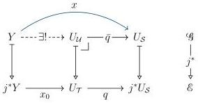
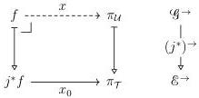

STRICT UNIVERSES FOR GROTHENDIECK TOPOI

47

We may use the base $x: Y \longrightarrow U_S$ of the glued morphism from Diagram 47 to extend $x_0$ to $\mathcal{U}$ as desired, repairing our failed attempt from Diagram 46:

In fact, this construction above gives a slightly stronger result than (U5).

6.3.7. THEOREM. Given $f: X \longrightarrow Y \in \mathcal{U}$ together with a cartesian map $x_0: j^*f \longrightarrow \pi_{\mathcal{T}}$, there exists a cartesian map $x: f \longrightarrow \pi_{\mathcal{U}}$ lying over $x_0$:

This property is particularly useful in proofs of metatheorems of type theories based on Artin gluing [Gra22; SA21; SAG22]. In this context, one typically requires not only that $\mathcal{U}$ be a pre-universe, but that the chosen codes witnessing (U3,4) are moreover preserved by $j^*$. Without Theorem 6.3.7, these strict equations would preclude a conceptual construction of these codes.

6.3.8. REMARK. Uemura [Uem17] presents an alternative construction for a pre-universe in $\mathcal{G}$ satisfying Theorem 6.3.7. Rather than relying on (U8), Uemura begins with separate pre-universes from $\mathcal{E}$ and $\mathcal{F}$ and combines them directly. This explicit decomposition ensures that the resultant universe satisfies the special case of (U8) necessary for Theorem 6.3.7.

## 7. Conclusions and future work

We have shown that every Grothendieck topos can be equipped with a cumulative hierarchy of universes satisfying (U1–8) assuming sufficient universes in the background set theory. This result is important because it extends the Hofmann–Streicher interpretation of Martin-Löf type theory in presheaf topoi to arbitrary sheaf topoi.