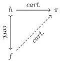
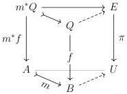
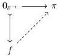

STRICT UNIVERSES FOR GROTHENDIECK TOPOI

5

where $f \in \mathcal{S}$:

Unless otherwise specified, $\mathcal{M}$ is the class of all monomorphisms.

1.1.5. REMARK. While Shulman [Shu15] extracted (U8) from the construction of the universal Kan fibration given by Kapulkin, Lumsdaine, and Voevodsky [KL21], similar properties have since appeared in the construction of the universal left fibration [Cis19, Corollary 5.2.6] and the universal cocartesian fibration [Lur22, Tag 0293].
1.1.6. REMARK. Unfolding the fibrational language, Definition 1.1.4 can be stated more explicitly. We require that given $m: A \mapsto B \in \mathcal{M}$ and $f: Q \mapsto B \in \mathcal{S}$, any cartesian square $m^*f \mapsto \pi$ extends along $m$ to a cartesian square $f \mapsto \pi$:

Intuitively, (U8) extends (U5) to provide a more refined generic map where a representation $f \mapsto \pi$ of an arrow $f \in \mathcal{S}$ can be chosen to strictly extend a representation of $g$ where $g \mapsto f \in \mathcal{M}$. In practice, one often exhibits a representation $f \mapsto \varpi$ to show $f \in \mathcal{S}$ only to discard this square to obtain a realigned representation of $f$ which coheres with a previously chosen representation of $g \mapsto f$ using (U8).

We note that (U8) subsumes (U5) under appropriate conditions on $\mathcal{M}$.

1.1.7. LEMMA. Suppose $\mathcal{S}$ is a pullback-stable class of maps and $\pi \in \mathcal{S}$ is a morphism satisfying (U8) with $\mathcal{M}$ containing all maps of the form $\mathbf{0}_{\mathcal{E} \to} \longrightarrow f$, where $\mathbf{0}_{\mathcal{E} \to}$ is the identity map on $\mathbf{0}_{\mathcal{E}}$; then the pair $(\mathcal{S}, \pi)$ satisfies (U5).

PROOF. Fixing an element $f \in \mathcal{S}$, we must construct a cartesian morphism $f \longrightarrow \pi$; this is achieved by realigning $\mathbf{0}_{\mathcal{E} \to} \longrightarrow \pi$ along $\mathbf{0}_{\mathcal{E} \to} \longmapsto f$:

