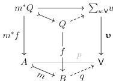

8

DANIEL GRATZER AND MICHAEL SHULMAN AND JONATHAN STERLING

2.1.1. CONSTRUCTION. Define the universe $\mathcal{S}_{\mathsf{V}} \subseteq \operatorname{Hom}_{\mathbf{Set}}$ to be the collection of all morphisms $f \colon X \longrightarrow Y$ with $\mathsf{V}$-small fibers: explicitly for each $y \in Y$, there exists a $u \in \mathsf{V}$ such that $u \cong f^{-1}(y)$.

Showing that $\mathcal{S}_{\mathsf{V}}$ satisfies axioms (U1–4,6,7) is a standard exercise. Setting $\widetilde{\mathsf{V}} = \sum_{u:\mathsf{V}} u$, the generic map is given by the projection $\mathbf{v} \colon \widetilde{\mathsf{V}} \longrightarrow \mathsf{V}$. The proof that $\mathbf{v}$ is generic mostly unsurprising but we note that the axiom of choice is required—essentially to produce an assignment of $\mathsf{V}$ representatives for the fibers of a morphism in $\mathcal{S}_{\mathsf{V}}$ which are known only to be isomorphic to elements of $\mathsf{V}$.

2.1.2. LEMMA. *The universe $\mathcal{S}_{\mathsf{V}}$ satisfies the realignment axiom (U8).*

PROOF. Recalling the characterization of (U8) given by Remark 1.1.6, we fix a realignment problem of the following form:

Suppose further that $f \in \mathcal{S}_{\mathsf{V}}$ and, through (U5), pick some morphism $q_0 \colon B \longrightarrow \mathsf{V}$ classifying $f$. While $q_0$ does not necessarily fit into the above diagram, we use it to define a map $q \colon B \longrightarrow \mathsf{V}$ that does:

$$q(b) = \begin{cases} p(a) & \text{when } b = m(a) \\ q_0(b) & \text{otherwise} \end{cases}$$

This definition is well-defined as $m$ is a monomorphism; there is at most one $a$ such that $m(a) = b$. By definition $q$ fits into the triangle above, and an identical procedure extends it to the required cartesian square $f \longrightarrow \mathbf{v}$.

2.1.3. REMARK. The above proof can be generalized to show that any universe in a boolean topos satisfying (U5) satisfies (U8).

2.1.4. REMARK. In the category of sets, any universe in the sense of the present axioms determines a universe in the sense of Grothendieck. Streicher's axioms for universes can therefore be thought of as a more *direct* alternative to Grothendieck's axioms, emphasizing ordinary mathematical constructions (*e.g.* dependent product, sum, quotient) rather than set theoretical considerations (transitive membership, power sets, *etc.*).

2.2. HOFMANN AND STREICHER'S UNIVERSE OF PRESHEAVES. Given a $\mathsf{V}$-small category $\mathcal{C}$, the universe $\mathcal{S}_{\mathsf{V}}$ induces a suitable universe $\hat{\mathcal{S}}_{\mathsf{V}}$ on $\operatorname{Pr}(\mathcal{C})$ that we explore below.