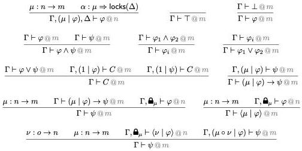

Figure 1: Rules of Multimodal Logic

\[
\Gamma , \widehat {\mathbf {m}} _ {\mu}, \widehat {\mathbf {m}} _ {\nu} = \Gamma , \widehat {\mathbf {m}} _ {\mu \circ \nu} \operatorname{ctx} @ o \tag {2}
\]

This last equation also reveals the reason that \(-, \widehat{\mathbf{m}}_{\mu}\) is best written as a postfix operator: as it is contravariant, writing it at the end preserves the order of symbols when composing modalities.

### 3.4. Rules

We are now able to introduce the logical rules of the system. The complete list is given in Fig. 1.

Propositional connectives The rules for the propositional constants and connectives \(\top\), \(\bot\), \(\wedge\), and \(\vee\) are the standard rules of natural deduction. The only difference is that they have become parametric in the mode \(@m\), which they carry from premise to conclusion. In the case of \(\vee\), the elimination rule creates 'local assumptions' as usual; but because of the structure of contexts these need to be tagged with a modality. We pick the identity modality 1, so that the rule remains completely mode-local. Therefore, the rules for all but one of the usual propositional connectives apply in an unchanged form within a single mode. The only exception is the compound modal implication.

Using assumptions The usual variable rule of natural deduction

\[
\overline {{\Gamma , \varphi , \Delta \vdash \varphi}}
\]

10