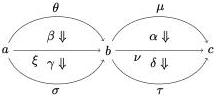

Picking $\alpha \stackrel{\mathrm{def}}{=} 4 : \square \Rightarrow \square^2$ and $\theta \stackrel{\mathrm{def}}{=} \square$ we obtain a transformation

$$4 * \square : \square^2 \Rightarrow \square^3$$

which, modulo isomorphisms, is the desired conclusion $\square\square\varphi \to \square\square\square\varphi$. Thus, transformations of modalities along with their vertical and horizontal compositions can be used to systematically encode various interaction laws between modalities.

It may not come as a surprise that this type of structure is already well-known: the ingredients used above are precisely the components of a (strict) 2-category, i.e. a category which is also equipped with morphisms between morphisms, which can be composed vertically (i.e. in the same hom-set) as well as horizontally (between hom-sets whose source and targets match). To have the structure of a 2-category these two compositions need to be compatible, i.e. to obey the interchange law: for any modalities and transformations fitting into the diagram

we must have that no matter which direction we compose in first, the result should be the same:

$$(\delta \circ \alpha) * (\gamma \circ \beta) = (\alpha * \beta) \circ (\delta * \alpha)$$

The structure of 2-categories is rich, and of foundational interest to category theory. Of course, the terminology is different: highers category theorists do not speak of modes, modalities, and transformations, but of morphisms and n-cells. The correspondence of terms between 2-categories and our multimodal logic can be summarised as follows:

$$\begin{array}{l} \text{object} \sim \text{mode} \\ \text{morphism (1-cell)} \sim \text{modality} \\ \text{2-cell} \sim \text{transformation (natural map between modalities)} \end{array}$$

In this manner we are able to give a very precise definition of a mode theory:

**Definition 2.1.** A mode theory is a (strict) 2-category.

Unfortunately, we cannot expand on the subject any further in this paper. For introductory treatments of 2-categories we refer the reader to books by Mac Lane [Mac78, §XII.3] and Borceux [Bor94, §7].

### 3. FORMULAS AND JUDGEMENTS

Having sketched how mode theories can be used to encode the modal structure of a modal logic, we now turn to defining the formulas of our logic as well as its proof system.

6