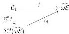
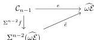

10

HADZIHASANOVIC, LOUBATON, OZORNOVA, AND ROVELLI

satisfying (1.28). This completes the inductive step. Since $\Sigma^{n-1}$ preserves sequential colimits by Proposition 1.1, for each $a \in \mathrm{bieq}_n\mathcal{D}$, we obtain universally an $\omega$-functor $\tilde{a} \colon \Sigma^{n-1}(\widehat{\omega\mathcal{E}}) \to \mathcal{D}$ such that (1.27) commutes.

Conversely, for each $n \geq 0$, let

$$E_n := \{a \in \mathcal{D}_n \mid \text{there exists } \tilde{a} \colon \Sigma^{n-1}\widehat{\omega\mathcal{E}} \to \mathcal{D} \text{ such that } a = \tilde{a} \circ \Sigma^{n-1}f\};$$

we will show that $E := \coprod_{n \geq 0} E_n$ is a bi-invertibility set. Let $a \in E_n$. By definition there exists $\tilde{a}$ such that $a = \tilde{a} \circ \Sigma^{n-1}f$. In particular, there are $(n+1)$-cells

$$c \colon a^L \begin{matrix} * & a \to \mathrm{id}_{d_{n-1}^-a} \end{matrix} \quad \text{and} \quad c' \colon a \begin{matrix} * & a^R \to \mathrm{id}_{d_{n-1}^+a} \end{matrix}$$

in the image of $\Sigma^{n-1}\widehat{\omega\mathcal{E}}^{(2)}$ through $\tilde{a}$. Then

$$\tilde{c} := \tilde{a} \circ \Sigma^{n-1}(\alpha_\infty) \colon \Sigma^n\widehat{\omega\mathcal{E}} \to \mathcal{D} \quad \text{and} \quad \tilde{c}' := \tilde{a} \circ \Sigma^{n-1}(\beta_\infty) \colon \Sigma^n\widehat{\omega\mathcal{E}} \to \mathcal{D}$$

are $\omega$-functors satisfying

$$c = \tilde{c} \circ \Sigma^n f, \qquad c' = \tilde{c}' \circ \Sigma^n f.$$

It follows that $c, c' \in E_{n+1}$. This completes the proof.

*Remark 1.29.* By construction, $\widehat{\omega\mathcal{E}}$ is a polygraph, whose set of $k$-cells is freely generated by the set $E_k$ defined, inductively on $k$, by

$$(1.30) \quad E_0 := \{p, q\}, \; E_1 := \{f, g, g'\}, \; E_k := \alpha_\infty(\Sigma E_{k-1}) \cup \beta_\infty(\Sigma E_{k-1}) \text{ for } k > 1.$$

**Lemma 1.31.** *With reference to the notation of (1.30), let $n > 0$ and $a \in E_n$. Then $a \in \mathrm{bieq}_n\widehat{\omega\mathcal{E}}$.*

*Proof.* First, suppose that $n = 1$ and $a = f$. Then the classifying $\omega$-functor $f \colon \mathcal{C}_1 \to \widehat{\omega\mathcal{E}}$ factors as $\mathrm{id}_{\widehat{\omega\mathcal{E}}} \circ f$ as in

So, by Proposition 1.26 $f \in \mathrm{bieq}_1\widehat{\omega\mathcal{E}}$. If $a = g$ or $a = g'$, then $a$ is a left or right weak inverse of $f$, so by Proposition 1.17, the 1-morphism $a$ is also a biequivalence.

Now, suppose that $n > 1$. Then there exists $e \in E_{n-1}$ such that $a = \alpha_\infty(\Sigma e)$ or $a = \beta_\infty(\Sigma e)$, and by the inductive hypothesis $e \in \mathrm{bieq}_{n-1}\widehat{\omega\mathcal{E}}$. By Proposition 1.26, there exists $\tilde{e} \colon \Sigma^{n-2}\widehat{\omega\mathcal{E}} \to \widehat{\omega\mathcal{E}}$ such that $e$ factors as in

Assume without loss of generality that $a = \alpha_\infty(\Sigma e)$. Then, letting $\tilde{a} := \alpha_\infty \circ \Sigma\tilde{e}$, we have that

$$a = \alpha_\infty \circ \Sigma(\tilde{e} \circ \Sigma^{n-2}f) = (\alpha_\infty \circ \Sigma\tilde{e}) \circ \Sigma(\Sigma^{n-2}f) = \tilde{a} \circ \Sigma^{n-1}f.$$