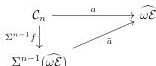

A MODEL FOR THE COHERENT WALKING $\omega$-EQUIVALENCE

11

so $a$ factors as in

Hence, we conclude by Proposition 1.26 that $a \in \mathrm{bieq}_n \widehat{\omega\mathcal{E}}$, as desired. $\square$

**Proposition 1.32.** *Let $n > 0$ and $a \in (\widehat{\omega\mathcal{E}})_n$. Then $a \in \mathrm{bieq}_n \widehat{\omega\mathcal{E}}$.*

*Proof.* By Remark 1.29, the cells of $\widehat{\omega\mathcal{E}}$ are composition-generated, in the sense of [ABG$^+$23, Proposition 15.1.8], by the cells in $E := \coprod_{k \geq 0} E_k$. By Lemma 1.31, all the generators are biequivalences, and by Proposition 1.15 and Proposition 1.13, biequivalences are closed under composition. $\square$

The remainder of the paper is devoted to proving the following.

**Theorem 1.33.** *The unique $\omega$-functor $\widehat{\omega\mathcal{E}} \to \mathcal{C}_0$ is a weak equivalence in $\omega\mathcal{C}at_{\mathrm{can}}$.*

## 2. THE MARKED MODEL FOR THE COHERENT $\omega$-EQUIVALENCE

**2.1. Marked $\omega$-categories.** We briefly recall some notions on marked $\omega$-categories from [HL23, §2] that will be needed in this paper.

A *marked $\omega$-category* is a pair $(\mathcal{D}, t\mathcal{D})$ where $\mathcal{D}$ is an $\omega$-category and $t\mathcal{D} := \coprod_{n \geq 0} t\mathcal{D}_n$ is a sequence of sets such that for any $n > 0$, the set $t\mathcal{D}_n$ is a subset of $\mathcal{D}_n$ containing identities and closed under composition. The $\omega$-category $\mathcal{D}$ is called *the underlying $\omega$-category* and $t\mathcal{D}$ *the marking* of $\mathcal{D}$. A cell in $t\mathcal{D}$ is called *marked*. A *marked $\omega$-functor* $F: (\mathcal{D}, t\mathcal{D}) \to (\mathcal{E}, t\mathcal{E})$ consists of a marking-preserving $\omega$-functor $F: \mathcal{D} \to \mathcal{E}$. We denote $\omega\mathcal{C}at^+$ the category of marked $\omega$-categories and marked $\omega$-functors. The assignment $(\mathcal{D}, t\mathcal{D}) \mapsto \mathcal{D}$ of the underlying $\omega$-category of any marked $\omega$-category defines a forgetful functor $U: \omega\mathcal{C}at^+ \to \omega\mathcal{C}at$.

**Notation 2.1.** Given an $\omega$-category $\mathcal{D}$, one can consider various choices of interest for the marking on $\mathcal{D}$:

- » If $\mathrm{id}\,\mathcal{D}$ denotes the set of identities of $\mathcal{D}$, the class $\mathrm{id}\,\mathcal{D}$ is closed under composition and contains identities. So, $(\mathcal{D}, \mathrm{id}\,\mathcal{D}) =: \mathcal{D}^\flat$ is a marked $\omega$-category. The assignment $\mathcal{D} \mapsto \mathcal{D}^\flat$ defines a functor $(-)^\flat: \omega\mathcal{C}at \to \omega\mathcal{C}at^+$.
- » If $\mathrm{mor}\,\mathcal{D}$ denotes the set of cells of $\mathcal{D}$ of strictly positive dimension, the class $\mathrm{mor}\,\mathcal{D}$ is closed under composition and contains identities. So, $(\mathcal{D}, \mathrm{mor}\,\mathcal{D}) =: \mathcal{D}^\sharp$ is a marked $\omega$-category. The assignment $\mathcal{D} \mapsto \mathcal{D}^\sharp$ defines a functor $(-)^\sharp: \omega\mathcal{C}at \to \omega\mathcal{C}at^+$.
- » If $\mathrm{eq}\,\mathcal{D}$ denotes the set of $\omega$-equivalences of $\mathcal{D}$ as in Definition 1.3, by [ABG$^+$23, Lemma 20.1.4] the class $\mathrm{eq}\,\mathcal{D}$ is closed under composition and contains identities. So, $(\mathcal{D}, \mathrm{eq}\,\mathcal{D}) =: \mathcal{D}^\sharp$ is a marked $\omega$-category. By Proposition 1.26, the assignment $\mathcal{D} \mapsto \mathcal{D}^\sharp$ defines a functor $(-)^\sharp: \omega\mathcal{C}at \to \omega\mathcal{C}at^+$.

The following adjoint pairs can be checked by verifying the appropriate universal properties, and using Proposition 1.1 for the second one.

**Proposition 2.2.** *There are adjunctions*

$$(-)^\flat: \omega\mathcal{C}at \rightleftarrows \omega\mathcal{C}at^+: U \quad \text{and} \quad U: \omega\mathcal{C}at^+ \rightleftarrows \omega\mathcal{C}at: (-)^\sharp.$$

*In particular, the functor $U: \omega\mathcal{C}at^+ \to \omega\mathcal{C}at$ preserves limits and colimits.*