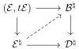
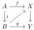
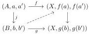

A MODEL FOR THE COHERENT WALKING $\omega$-EQUIVALENCE

13

**Lemma 2.5.** Given a marked $\omega$-category $(\mathcal{E}, t\mathcal{E})$ with $t\mathcal{E} \subseteq \operatorname{eq}\mathcal{E}$, the canonical morphism

$$(\mathcal{E}, t\mathcal{E}) \hookrightarrow \mathcal{E}^{\natural}$$

is an acyclic cofibration in $\omega\mathcal{C}at_{\text{coind}}^{+}$.

Proof. In order to show that $(\mathcal{E}, t\mathcal{E}) \to \mathcal{E}^{\natural}$ has the left lifting property with respect to any fibration between fibrant objects $p: \mathcal{B}^{\natural} \to \mathcal{D}^{\natural}$ in $\omega\mathcal{C}at_{\text{coind}}^{+}$, consider the following lifting problem in $\omega\mathcal{C}at^{+}$:

A lift exists (because $(-)^{\natural}: \omega\mathcal{C}at \to \omega\mathcal{C}at^{+}$ is a functor), and is necessarily given by the top map at the level of underlying categories. It follows that $(\mathcal{E}, t\mathcal{E}) \to \mathcal{E}^{\natural}$ is an acyclic cofibration in $\omega\mathcal{C}at_{\text{coind}}^{+}$, as desired. $\square$

**Notation 2.6.** Given a marked $\infty$-category $(\mathcal{D}, t\mathcal{D})$, we denote by $\Sigma(\mathcal{D}, t\mathcal{D}) := (\Sigma\mathcal{D}, \{\Sigma a, a \in t\mathcal{D}\} \cup \operatorname{id}(\Sigma\mathcal{D}))$ the marked suspension of $(\mathcal{D}, t\mathcal{D})$.

Remark 2.7. By definition, given a marked $\infty$-category $(\mathcal{D}, t\mathcal{D})$, there is a canonical isomorphism in $\omega\mathcal{C}at$

$$U\Sigma(\mathcal{D}, t\mathcal{D}) \cong \Sigma\mathcal{D} \cong \Sigma U(\mathcal{D}, t\mathcal{D}).$$

**Proposition 2.8.** The functor $\Sigma: \omega\mathcal{C}at_{\text{coind}}^{+} \to \omega\mathcal{C}at_{\text{coind}}^{+}$ preserves acyclic cofibrations.

Proof. We say that

- a map of $\omega\mathcal{C}at_{*,*}^{+}$ is a fibration in $(\omega\mathcal{C}at_{\text{coind}}^{+})_{*,*}$ if it is one in $\omega\mathcal{C}at_{\text{coind}}^{+}$ when ignoring the base points;
- an object of $\omega\mathcal{C}at_{*,*}^{+}$ is fibrant in $(\omega\mathcal{C}at_{\text{coind}}^{+})_{*,*}$ if it is one in $\omega\mathcal{C}at_{\text{coind}}^{+}$ when ignoring the base points;
- a map of $\omega\mathcal{C}at_{*,*}^{+}$ is an acyclic cofibration in $(\omega\mathcal{C}at_{\text{coind}}^{+})_{*,*}$ if it has the left lifting property with respect to all fibrations between fibrant objects.

As a preliminary observation, we argue that the functor

$$U: (\omega\mathcal{C}at_{\text{coind}}^{+})_{*,*} \to \omega\mathcal{C}at_{\text{coind}}^{+}$$

preserves acyclic cofibrations. Let $j: (A, a, a') \to (B, b, b')$ be an acyclic cofibration in $(\omega\mathcal{C}at_{\text{coind}}^{+})_{*,*}$, and consider a lifting problem in $\omega\mathcal{C}at_{\text{coind}}^{+}$

This can be enhanced to a lifting problem in $(\omega\mathcal{C}at_{\text{coind}}^{+})_{*,*}$

