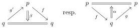
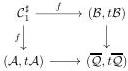

14

HADZIHASANOVIC, LOUBATON, OZORNOVA, AND ROVELLI

This lifting problem admits a solution because, by definition, the left hand side map is an acyclic cofibration in  \( (\omega\mathcal{C}at_{\mathrm{coind}}^{+})_{*,*} \)  and the right hand side map is a fibration in  \( (\omega\mathcal{C}at_{\mathrm{coind}}^{+})_{*,*} \) .

Consider the adjunction

\[
\Sigma \colon \omega \mathcal {C} a t _ {\text {coind}} ^ {+} \leftrightarrows (\omega \mathcal {C} a t _ {\text {coind}} ^ {+}) _ {*, *} \text {:hom}.
\]

We first observe that the functor

\[
\mathrm{hom} \colon (\omega \mathcal {C} a t _ {\mathrm{coind}} ^ {+}) _ {*, *} \to \omega \mathcal {C} a t _ {\mathrm{coind}} ^ {+}
\]

preserves fibrant objects. To see this, one can use the characterization of fibrant objects from Theorem 2.4(3), and observe that given a marked \(\omega\)-category \(\mathcal{D}\) and \(a \in \mathrm{eq}_k\mathcal{D}\) for \(k > 1\), then \(a \in \mathrm{eq}_{k-1} \hom_{\mathcal{D}}(d_0^- a, d_0^+ a)\). Further, the functor

\[
\Sigma \colon \omega \mathcal {C} a t _ {\mathrm{coind}} ^ {+} \to (\omega \mathcal {C} a t _ {\mathrm{coind}} ^ {+}) _ {*, *}
\]

sends the marked \(\omega\)-functor \(i_n^+ \colon \mathcal{C}_n^\circ \hookrightarrow (\mathcal{C}_{n+1}, \{e_{n+1}\} \cup \mathrm{id}\mathcal{C}_{n+1})\) to the marked \(\omega\)-functor \(i_{n+1}^+ \colon \mathcal{C}_{n+1}^\circ \hookrightarrow (\mathcal{C}_{n+2}, \{e_{n+2}\} \cup \mathrm{id}\mathcal{C}_{n+2})\). Hence, by Theorem 2.4(5), the functor

\[
\mathrm{hom} \colon (\omega \mathcal {C} a t _ {\mathrm{coind}} ^ {+}) _ {*, *} \to \omega \mathcal {C} a t _ {\mathrm{coind}} ^ {+}
\]

preserves fibrations between fibrant objects. Finally, by definition of acyclic cofibrations and using the adjunction  \( \Sigma \dashv \)  hom, the functor

\[
\Sigma \colon \omega \mathcal {C} a t _ {\mathrm{coind}} ^ {+} \to : (\omega \mathcal {C} a t _ {\mathrm{coind}} ^ {+}) _ {*, *}
\]

preserves acyclic cofibrations, and so does the functor

\[
U \Sigma \colon \omega \mathcal {C} a t _ {\mathrm{coind}} ^ {+} \to (\omega \mathcal {C} a t _ {\mathrm{coind}} ^ {+}) _ {*, *} \to : \omega \mathcal {C} a t _ {\mathrm{coind}} ^ {+},
\]

as desired.

□

### 2.3. The marked model for the coherent  \( \omega \) -equivalence.

Construction 2.9. Let B, resp. A, denote the  \( \omega \) -category freely generated by the following datum

Let \((\mathcal{A}, t\mathcal{A})\), resp. \((\mathcal{B}, t\mathcal{B})\), denote the marked \(\omega\)-category for which \(t\mathcal{A}\), resp. \(t\mathcal{B}\), is minimal with the property that \(t\mathcal{A} \supseteq \mathrm{id}\mathcal{A} \cup \{f, \alpha\}\), resp. \(t\mathcal{B} \supseteq \mathrm{id}\mathcal{B} \cup \{f, \beta\}\). Let \((\overline{\mathcal{Q}}, t\overline{\mathcal{Q}})\) denote the marked \(\omega\)-category obtained as the pushout in \(\omega\mathcal{C}at^{+}\):

We refer the reader to [HL23, Construction 2.14] for a description of pushouts in \(\omega \mathcal{C}at^{+}\).

Lemma 2.10. The marked \(\omega\)-functor

\[
f \colon \mathcal {C} _ {1} ^ {\sharp} \to (\overline {{\mathcal {Q}}}, t \overline {{\mathcal {Q}}})
\]

is an acyclic cofibration in \(\omega \mathcal{C}at_{\mathrm{coind}}^{+}\).