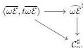

A MODEL FOR THE COHERENT WALKING $\omega$-EQUIVALENCE

19

is then also a weak equivalence in $\omega\mathcal{C}at_{\text{coind}}^+$, as desired. $\square$

We can finally now prove the main theorem, namely that the unique morphism $\widehat{\omega\mathcal{E}} \to \mathcal{C}_0$ is a weak equivalence in $\omega\mathcal{C}at_{\text{can}}$:

*Proof of Theorem 1.33.* Consider the commutative diagram in $\omega\mathcal{C}at_{\text{coind}}^+$

By Propositions 2.20 and 2.22, the top and the diagonal marked $\omega$-functors are weak equivalences in $\omega\mathcal{C}at_{\text{coind}}^+$. By two-out-of-three, so is the right vertical marked $\omega$-functor

$$\widehat{\omega\mathcal{E}}^\sharp \to \mathcal{C}_0^\sharp.$$

By Theorem 2.4(3), the marked $\omega$-categories $\widehat{\omega\mathcal{E}}^\sharp$ and $\mathcal{C}_0^\sharp$ are fibrant in $\omega\mathcal{C}at_{\text{coind}}^+$. By Theorem 2.4(4), the forgetful functor $U: \omega\mathcal{C}at_{\text{coind}}^+ \to \omega\mathcal{C}at_{\text{can}}$ preserves weak equivalences between fibrant objects, so the unique $\omega$-functor

$$\widehat{\omega\mathcal{E}} = U(\widehat{\omega\mathcal{E}}^\sharp) \to U(\mathcal{C}_0^\sharp) = U(\mathcal{C}_0^\sharp) = \mathcal{C}_0$$

is a weak equivalence in $\omega\mathcal{C}at_{\text{can}}$, as desired. $\square$

# REFERENCES

[ABG$^+$23] Dimitri Ara, Albert Burroni, Yves Guiraud, Philippe Malbos, François Métayer, and Samuel Mimram, *Polygraphs: From rewriting to higher categories*, arXiv:2312.00429v1, 2023. 1, 2, 3, 11
[AL20] Dimitri Ara and Maxime Lucas, *The folk model category structure on strict $\omega$-categories is monoidal*, Theory Appl. Categ. **35** (2020), Paper No. 21, 745–808. 2, 4
[AM20] Dimitri Ara and Georges Maltsiniotis, *Joint et tranches pour les $\infty$-catégories strictes*, Mém. Soc. Math. Fr. (N.S.) (2020), no. 165, vi+213. 1, 2, 3
[BW24] Michael Batanin and David White, *Left Bousfield localization without left properness*, J. Pure Appl. Algebra **228** (2024), no. 6, Paper No. 107570, 23. 12
[Che07] Eugenia Cheng, *An $\omega$-category with all duals is an $\omega$-groupoid*, Applied Categorical Structures **15** (2007), 439–453. 2
[cli22] tslil clingman, *Towards the theory of proof-relevant categories*, Ph.D. thesis, Johns Hopkins University, 2022. 2
[FHM23] Soichiro Fujii, Keisuke Hoshino, and Yuki Maehara, *Weakly invertible cells in a weak $\omega$-category*, arXiv:2303.14907v2, 2023. 1, 2
[Gol23] Zach Goldthorpe, *Homotopy theories of $(\infty, \infty)$-categories as universal fixed points with respect to weak enrichment*, Int. Math. Res. Not. IMRN (2023), no. 22, 19592–19640. 1
[Gol24] Zach Goldthorpe, *Sheaves of $(\infty, \infty)$-categories*, arXiv:2403.06926v3, 2024. 1
[Gur12] Nick Gurski, *Biequivalences in tricategories*, Theory Appl. Categ. **26** (2012), No. 14, 349–384. 2
[Had20] Amar Hadzihasanovic, *Diagrammatic sets and rewriting in weak higher categories*, arXiv:2007.14505v1, 2020. 2
[Hen20] Simon Henry, *Weak model categories in classical and constructive mathematics*, Theory Appl. Categ. **35** (2020), Paper No. 24, 875–958. 12
[Hen23] ______, *Combinatorial and accessible weak model categories*, J. Pure Appl. Algebra **227** (2023), no. 2, Paper No. 107191, 46. 12
[Hir21] Philip S. Hirschhorn, *Overcategories and undercategories of cofibrantly generated model categories*, J. Homotopy Relat. Struct. **16** (2021), no. 4, 753–768. 3