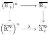

hence

$$U = \bigvee_{q, V \leqslant q U} f^*(B_q f_l V) = f^* \left( \bigvee_{q, V \leqslant q U} B_q f_l V \right)$$

In particular, if $X$ is metric, then this works for an arbitrary $U$ and $f^*$ is surjective.

If $X$ is no longer metric, then let $U' = \bigvee_{V \in U} V$, then $U'$ satisfy $U' = \bigvee_{V \in U'} V$ and hence the first part can be applied to $U'$ and there exists $V$ such that $U' = f^*(V)$. In particular, as $f^*(V) \leqslant U$ we obtain that $V \leqslant f_*(U)$ and hence

$$U' = f^*(V) \leqslant f^*(f_*(U)).$$

The inequality $f^*(f_*(U)) \leqslant U$ being always true this concludes the proof. $\square$

3.2.3. The following proposition allows one to extend by density relations between continuous functions with values in metric locale.

Proposition : Let $f, g : X \rightrightarrows Y$ be two maps of locales with $Y$ a metric locale (or more generally a fiberwise separated locale). Assume that $f$ and $g$ coincide on some fiberwise dense sublocale $T \subset X$. Then $f = g$.

Proof :

Let $V$ be the pull-back of the diagonal of $Y$ by the map $(f, g) : X \to Y \times Y$. As fiberwise closeness is stable under pull-back (see [12] C1.2.14(v)), $V$ is a fiberwise closed sublocale of $X$, containing the fiberwise dense sublocale $T$, hence $V = X$, and this concludes the proof. $\square$

3.2.4. We will also sometimes need to extend by continuity "metric relations" between functions, which will generally be about comparing functions with value in $\overleftarrow{\mathbb{R}}_+^\infty$. As $\overleftarrow{\mathbb{R}}_+^\infty$ is not fiberwise separated, it is not possible to apply directly the previous result. However, one has the following statement:

We will say that a function from $m : X \to \overleftarrow{\mathbb{R}}_+^\infty$ is admissible if there exist two families of functions $f_1, \dots f_n$ and $g_1, \dots, g_n$ from $X$ to pre-metric locales $X_1, \dots X_n$ and a commutative diagram:

(where the vertical arrows are the canonical maps) such that:

$$m(x) = \lambda(d(f_1(x), g_1(x)), \dots, d(f_n(x), g_n(x))).$$

31