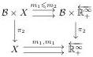
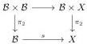

It is probably possible to use a more general definition of “admissible” map, but this one will be enough for all the applications appearing here.

Proposition : Assume that one has two admissible maps  \( m_{1}, m_{2}: X \Rightarrow \overleftarrow{R_{+}^{\infty}} \)  such that one has an inequality  \( m_{1} \leqslant m_{2} \)  on some fiberwise dense sublocale S of X a locally positive locale, then the inequality holds one the whole X.

#### Proof :

The idea is to pull-back everything to some boolean locale \(\mathcal{B}\). In the logic of \(\mathcal{B}\), thanks to 3.1.7 the admissible functions \(m_1\) and \(m_2\) will factor as functions \(X \Rightarrow \overline{\mathbb{R}}\) still satisfying an inequality over \(S\). The pull-back of \(S\) is still fiberwise dense in the pull-back of \(X\) because of 2.3.14, but, contrary to \(\overleftarrow{\mathbb{R}_+^\infty}\), \(\mathbb{R}\) is (fiberwise) separated and hence one can conclude that in the category of sheaves over \(\mathcal{B}\) the pull-backs of \(m_1\) and \(m_2\) agree on the pull-back of \(X\) by 3.2.3. This implies that (in the base topos) one has a diagram:

In order to conclude that  \( m_{1} \leqslant m_{2} \)  it is enough to choose B such that  \( \pi_{2}: B \times X \to X \)  is surjective. It is possible, indeed, if one chooses a boolean locale B which covers X, i.e. with a surjective map  \( s: B \to X \)  then:

The projection  \( \pi_{2}:B\times B\to B \)  is a surjection because it has a section, the map  \( s:B\to X \)  is surjective by hypothesis, hence the diagonal map is surjective. This implies that the map  \( \pi_{2}:B\times X\to X \)  is surjective and hence it concludes the proof. ☐

Of course the same result where the inequality is replaced by an equality also holds by two applications of this result.

### 3.3 Completion of a metric locale

In this subsection we will define the completion of pre-metric locale as the space of minimal Cauchy filters. The same idea has been previously used by S.Vickers in [18].

32