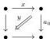

**3.3 Remark.** The name “equation” comes from the idea that we are looking for an element $x$ such that a certain composite of $x$ with other arrows is isomorphic to another given arrow. From this point of view, a map $\Lambda P \rightarrow X$ corresponds to such an equation in $X$, and an extension $P \rightarrow X$ corresponds to a solution of the equation, or rather the image of $x$ is the solution and $y$ represents the isomorphism witnessing that $x$ is a solution.

**3.4 Definition.** A morphism of $m$-marked polygraphs $\Omega P \rightarrow P$ is a *left saturation* if it is an isomorphism on the underlying polygraphs, and if there exists an integer $n$, and two marked generators $x, y$ of $P$ of dimension respectively $n$ and $n+1$, such that

1. (1) any marked generator of $P$ that is different from $x$ is marked in $\Omega P$,
2. (2) $x$ and $y$ are marked in $P$,
3. (3) the target of $y$ is marked,
4. (4) the arrows $x$ and $y$ satisfy the conditions (5) and (6) of Definition 3.1.

*Right saturations* are defined in the exact same way except the source and target of $y$ are exchanged in the last two conditions.

We say that $\Omega P \rightarrow P$ is an *saturation* to mean that it is either a left or right saturation.

**3.5 Construction.** Let $n$ be a non-negative integer. The morphism

$$j_+ \hat{\odot} i_n := I \odot \partial \mathbb{D}_n \coprod \{1\} \odot \mathbb{D}_n \rightarrow I \odot \mathbb{D}_n$$

is a left equation. Indeed, let $y$ be the top-dimensional generator of $I \odot \mathbb{D}_n$. If we denote by $x$ the top-dimensional arrow of $\{0\} \odot \mathbb{D}_n$, and for $0 < k \leq n$, by $a_k$ the image of the top-dimensional $k$-generator of $I \odot \mathbb{D}_{k-1}$ by the morphism

$$I \odot \delta_{k-1}^- : I \odot \mathbb{D}_{k-1} \rightarrow I \odot \mathbb{D}_n,$$

we recall that we gave an explicit description of $\mathbb{D}_1 \otimes \mathbb{D}_n$ in Example 2.12. The object we are interested in is $I \odot \mathbb{D}_n^\times$, which is the same polygraph endowed with the marking where all the arrows $a \otimes e_k^\times$ are marked. Using this description, we see that if we name $y = a \otimes e_n$ and $x = a_0^- \otimes e_n$ the two arrows of $I \odot \mathbb{D}_n$ that are not in the image of $j_+ \hat{\odot} i_n$, then we have a decomposition of the source of $y$ of the form:

$$(((x\#_0 a_0)\#_1 a_2) \dots)\#_{n-1} a_n$$

and all the $a_k$ are marked. We denote it

$$\mathbf{e}\mathbf{q}_n^\square : \Lambda \mathbf{E}\mathbf{q}_n^\square \rightarrow \mathbf{E}\mathbf{q}_n^\square.$$

**3.6 Example.** The underlying $\infty$-category of $\mathbf{E}\mathbf{q}_1^\square$ is

23