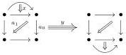
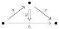

and the underlying $\infty$-category of $\mathbf{Eq}_2^{\sqsupset}$ is

3.7 Construction. Similarly, the morphism

$$j_+ \hat{\ominus} s_n \colon I \ominus \mathbb{D}_n \coprod \{1\} \ominus (\mathbb{D}_n, \overline{\{e_n\}}) \to I \ominus (\mathbb{D}_n, \overline{\{e_n\}})$$

where $s_n$ is the "identity" map $\mathbb{D}_n \to (\mathbb{D}_n, \overline{\{e_n\}})$ is a left saturation, which we denote

$$\mathbf{sat}_n^{\sqsupset} \colon \Omega \mathbf{Sat}_n^{\sqsupset} \to \mathbf{Sat}_n^{\sqsupset}.$$

3.8 Proposition. Generating anodyne cofibrations are either equations or saturations.

Proof. By Definition 2.38, the generating anodyne cofibrations are of the form $j_+ \hat{\ominus} i$ with $i$ being either $\partial \mathbb{D}_n \to \mathbb{D}_n$ or $\mathbb{D}_n \to (\mathbb{D}_n, \overline{\{e_n\}})$ for an integer $n$. By Constructions 3.5 and 3.7, these morphisms are either equations or saturations.

3.9 Definition. We define some left equations which play an important role. In each case, $k$ and $n$ are integers with $0 < k \leqslant n$.

- $\mathbf{eq}_{k,n}^{\sqsupset \diamond} \colon \Lambda \mathbf{Eq}_{k,n}^{\sqsupset \diamond} \to \mathbf{Eq}_{k,n}^{\sqsupset \diamond}$, whose codomain is generated by

- a \(n\)-arrow \(x\), a marked \(k\)-arrow \(a\) such that \(\pi_{k-1}^{+}(a) = \pi_{k-1}^{-}(x)\),
- a \(n\)-arrow \(b\) of source \(a\#_{k-1}\pi_{n-1}^{-}(y)\) (resp. \(\pi_{n-1}^{-}(a)\)) and of target \(a\#_{k-1}\pi_{n-1}^{+}(y)\) (resp. \(\pi_{n-1}^{+}(x)\)) if \(k < n\) (resp. if \(k = n\)),
- a marked \((n + 1)\)-arrow \(y\) of source \(a\#_{k - 1}x\) and of target \(b\),

and whose domain is obtained by removing $x$ and $y$.

- $\mathbf{eq}_{k,n}^{\diamond -} \colon \Lambda \mathbf{Eq}_{k,n}^{\diamond -} \to \mathbf{Eq}_{k,n}^{\diamond -}$, whose codomain is generated by

- a \(n\)-arrow \(x\), a marked \(k\)-arrow \(a\) such that \(\pi_{k - 1}^{+}(x) = \pi_{k - 1}^{-}(a)\),
- a \(n\)-arrow \(b\) of source \(\pi_{n - 1}^{-}(y)\#_{k - 1}a\) (resp. \(\pi_{n - 1}^{-}(x)\)) and of target \(\pi_{n - 1}^{+}(y)\#_{k - 1}a\) (resp. \(\pi_{n - 1}^{+}(a)\)) if \(k < n\) (resp. if \(k = n\)),
- a marked \((n + 1)\)-arrow \(y\) of source \(y\#_{k - 1}x\) and of target \(b\).

and whose domain is obtained by removing $x$ and $y$.

3.10 Example. The underlying $\infty$-category of $\mathbf{Eq}_{1,1}^{\sqsupset \diamond}$ is generated by the diagram

24