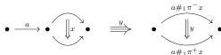
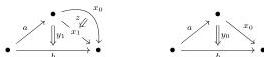

and the underlying $\infty$-category of $\mathbf{Eq}_{1,2}^{\circ}$ is generated by the diagram

**3.11 Definition.** Let $\Lambda P \rightarrow P$ be a left equation, and $n, x, y$ the integer and the two generators of Definition 3.1. We denote $(x_0, y_0)$ and $(x_1, y_1)$ the images of the couple $(x, y) \in P$ by the two inclusions $P \rightarrow P \coprod_{\Lambda P} P$. The $m$-marked polygraph $\mathrm{Uni}_{\Lambda P}(P)$ is obtained from $P \coprod_{\Lambda P} P$ by adding an unmarked $(n+1)$-generator $z$ of $n$-source $x_0$ and $n$-target $x_1$.

A map $f: P \coprod_{\Lambda P} P \rightarrow X$ corresponds to a map $\Lambda P \rightarrow X$, which is an equation in $X$, together with two solutions $P \rightarrow X$, given by pairs $(x_0, y_0)$ and $(x_1, y_1)$. The morphism $f$ lifts to $\mathrm{Uni}_{\Lambda P}(P)$ if there exists a marked arrow $z: x_0 \rightarrow x_1$. Formally, this expresses that the two solutions are equivalent.

**3.12 Example.** The underlying $\infty$-category of $\mathrm{Uni}_{\Lambda \mathbf{Eq}_{1,1}^{\circ}} (\mathbf{Eq}_{1,1}^{\circ})$ is

**3.13 Definition.** Let $C$ be an $m$-marked $\infty$-category and $\Lambda P \rightarrow P$ a left equation (resp. right equation).

The equation $\Lambda P \rightarrow P$ has solutions in $C$ if for all morphisms $\Lambda P \rightarrow C$, there exists a lifting $(x, y): P \rightarrow C$ such that $x$ is sent to a marked arrow whenever the target of $y$ is (resp. the source of $y$ is).

Solutions to an equation $\Lambda P \rightarrow P$ in $C$ are weakly unique if $C$ has the right lifting property against $P \coprod_{\Lambda P} P \rightarrow \mathrm{Uni}_{\Lambda P}(P)$.

The equation $\Lambda P \rightarrow P$ has weakly unique solutions in $C$ if the equation $\Lambda P \rightarrow P$ has solutions in $C$ and they are weakly unique.

It will be useful to have a “coherent” version of $\mathrm{Uni}_{\Lambda P}(P)$.

**3.14 Definition.** Let $\Lambda P \rightarrow P$ be a left equation, and $n, x, y$ the integer and the two generators of Definition 3.1. Suppose given a decomposition

$$\pi_n^- y = l_n \#_{n-1}(l_{n-1} \#_{n-2} \dots \#_1(l_1 \#_0 x \#_0 r_1) \#_1 \dots \#_{n-2} r_{n-1}) \#_{n-1} r_n$$

of the $n$-source of $y$. We denote $(x_0, y_0)$ and $(x_1, y_1)$ the images of the couple $(x, y) \in P$ by the two inclusions $P \rightarrow P \coprod_{\Lambda P} P$. The $m$-marked polygraph $\mathrm{Uni}_{\Lambda P}^{coh}(P)$ is obtained from $P \coprod_{\Lambda P} P$ by

1. (1) adding an unmarked $(n+1)$-generator $z$ of $n$-source $x_0$ and $n$-target $x_1$,
2. (2) adding a marked $(n+2)$-generator $w$ of $(n+1)$-source

$$l_n \#_{n-1}(l_{n-1} \#_{n-2} \dots \#_1(l_1 \#_0 z \#_0 r_1) \#_1 \dots \#_{n-2} r_{n-1}) \#_{n-1} r_n \#_n y_1$$

and of $(n+1)$-target $y_0$.

25