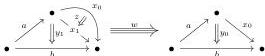

By construction, the morphism $P \coprod_{\Lambda P} P \rightarrow \operatorname{Uni}_{\Lambda P}^{coh}(P)$ is a left equation.

Let $\Lambda P \rightarrow P$ be a right equation, and $n, x, y$ the integer and the two generators of Definition 3.1. Suppose given a decomposition

$$\pi_n^+ y = l_n \#_{n-1}(l_{n-1} \#_{n-2} \dots \#_1(l_1 \#_0 x \#_0 r_1) \#_1 \dots \#_{n-2} r_{n-1}) \#_{n-1} r_n$$

of the $n$-target of $y$. We denote $(x_0, y_0)$ and $(x_1, y_1)$ the images of the couple $(x, y) \in P$ by the two inclusions $P \rightarrow P \coprod_{\Lambda P} P$. The $m$-marked polygraph $\operatorname{Uni}_{\Lambda P}(P)$ is obtained from $P \coprod_{\Lambda P} P$ by

(1) adding an unmarked $(n+1)$-generator $z$ of $n$-source $x_0$ and $n$-target $x_1$,
(2) adding a marked $(n+2)$-generator $w$ of $(n+1)$-source

$$y_0 \#_n l_n \#_{n-1}(l_{n-1} \#_{n-2} \dots \#_1(l_1 \#_0 z \#_0 r_1) \#_1 \dots \#_{n-2} r_{n-1}) \#_{n-1} r_n \rightarrow y_1$$

and of $(n+1)$-target $y_0$.

By construction, the morphism $P \coprod_{\Lambda P} P \rightarrow \operatorname{Uni}_{\Lambda P}^{coh}(P)$ is a right equation.

**3.15 Remark.** Let $\Lambda P \rightarrow P$ be an equation and $X$ a $m$-marked $\infty$-category. A map $f: P \coprod_{\Lambda P} P \rightarrow X$ corresponds to a map $\Lambda P \rightarrow X$, together with two solutions $P \rightarrow X$ given by pairs $(x_0, y_0)$ and $(x_1, y_1)$. If the equation $P \coprod_{\Lambda P} P \rightarrow \operatorname{Uni}_{\Lambda P}^{coh}(P)$ has a solution in $C$, it implies that given any pair of solutions $(x_0, y_0)$ and $(x_1, y_1)$ of $\Lambda P \rightarrow P$, there exists a marked arrow $z: x_0 \rightarrow x_1$, which informally expresses that the two solutions are equivalent, together with marked arrows

$$l_n \#_{n-1}(l_{n-1} \#_{n-2} \dots \#_1(l_1 \#_0 z \#_0 r_1) \#_1 \dots \#_{n-2} r_{n-1}) \#_{n-1} r_n \#_n y_1 \rightarrow y_0$$

(resp.

$$y_0 \#_n l_n \#_{n-1}(l_{n-1} \#_{n-2} \dots \#_1(l_1 \#_0 z \#_0 r_1) \#_1 \dots \#_{n-2} r_{n-1}) \#_{n-1} r_n \rightarrow y_1$$

which express a compatibility between $z, y_0$, and $y_1$.

In particular, this implies that the equation $\Lambda P \rightarrow P$ has weakly unique solutions in $C$.

**3.16 Example.** The underlying $\infty$-category of $\operatorname{Uni}_{\Lambda \mathbf{Eq}_{1,1}}^{coh}(\mathbf{Eq}_{1,1}^{\circ})$ is

## 3.2 Characterization of Fibrant Objects of The Inductive Left Semi-Model Structure

In this section, we will give a simple characterization of the fibrant objects of the left semi-model structure introduced in Theorem 2.43. We will temporarily call the objects satisfying this characterization “prefibrant” (Definition 3.18) and then show in Proposition 3.25 that these are exactly the fibrant objects.

26