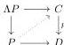
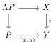

**3.27 Notation.** Suppose given an equation $\Lambda P \rightarrow P$ and a lifting problem of the form:

Given $a$ a generator of $P$, we will denote its image in $D$ also by $a$. If $a \in \Lambda P$, we denote by $\bar{a}$ its image in $C$. So in general $p(\bar{a}) = a$. If the dotted diagonal lift exists, or if we are in the process of constructing such a lift, the image of $x, y \in P$ in $C$ is also denoted $\bar{x}$ and $\bar{y}$, and we hence also have $p(\bar{x}) = x$ and $p(\bar{y}) = y$.

Explicitly, a morphism $\pi: X \rightarrow Y$ between fibrant $m$-marked $\infty$-categories is an isofibration if for every $n$-dimensional arrow $f: a \rightarrow b$ in $X$, such that in $Y$ there is a parallel arrow $g: \pi(a) \rightarrow \pi(b)$ with a marked arrow $h: g \rightarrow \pi(f)$, then $g$ and $h$ can be lifted to arrows $\bar{g}: a \rightarrow b$ and $\bar{h}: \bar{g} \rightarrow f$ in $X$, with $\bar{h}$ marked, such that $\pi(\bar{g}) = g$ and $\pi(\bar{h}) = h$.

Note that it follows from Lemma 2.46 that fibrations are isofibrations. We insist on the fact that we will only consider the notion of isofibration between *fibrant* $m$-marked $\infty$-categories. We do not expect the definition given above to be very interesting outside this context.

**3.28 Lemma.** *Any isofibration between fibrant $m$-marked $\infty$-categories also has the lifting property against*

$$i_n^\sim: \mathbb{D}_n^b \rightarrow (\mathbb{D}_{n+1}, \overline{\{e_{n+1}\}}).$$

*Proof.* Let $\pi: X \rightarrow Y$ be an isofibration between fibrant $m$-marked $\infty$-categories, $f: a \rightarrow b$ an $n$-arrow in $X$, with $g: \pi(a) \rightarrow \pi(b)$ and $h: \pi(f) \rightarrow g$ two arrows in $Y$, where $h$ is marked.

As $Y$ is fibrant, according to Lemma 3.23, the arrow $h$ admits an inverse, i.e., there is a marked arrow $h^{-1}: g \rightarrow \pi(f)$ and another marked arrow $t: h^{-1} \#_n h \rightarrow \mathbb{I}_g$ witnessing the inverse relation. One can then apply the isofibration property to lift $g$ and $h^{-1}$ to two arrows $\bar{g}: a \rightarrow b$ and $\bar{h}^{-1}: \bar{g} \rightarrow f$.

As $X$ is also fibrant, one can then consider an inverse $\bar{h}$ of $\bar{h}^{-1}$ in $X$, whose image by $\pi$ will be a second inverse of $h^{-1}$ in $Y$, and again because $Y$ is fibrant, one can hence construct a marked arrow $h \rightarrow \pi(\bar{h})$. Applying the isofibration property one more time then gives us a lift of $h$ and concludes the proof. $\square$

**3.29 Lemma.** *An isofibration between fibrant $m$-marked $\infty$-categories has the right lifting property against all equations and saturations.*

*Proof.* We will show that such a morphism has the lifting property against all left equations; the exact same argument shows that it also has the lifting property against all right equations.

Consider an isofibration $\pi: X \rightarrow Y$ between two fibrant $m$-marked $\infty$-categories and a lifting problem of $\pi$ against $\Lambda P \rightarrow P$:

31