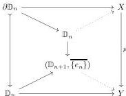

Definition 3.32. Indeed, suppose given a weak lifting diagram:

The solid part of the diagram corresponds to a pair of parallel $(n-1)$-arrows $(a, b)$ in $X$, together with an $n$-arrow $c: p(a) \rightarrow p(b)$ in $Y$. The top dotted morphism gives us an arrow $\tilde{c}: a \rightarrow b$, while the bottom dotted morphism corresponds to a marked $(n+1)$-arrow $e: p(\tilde{c}) \rightarrow c$. So this lifting condition corresponds exactly to the third point of Definition 3.32 (with the second point corresponding to the case $n=0$).

### 3.5 The Saturated Inductive Localization.

Proposition 3.25 produces a characterization of fibrant objects of the left semi-model structure of Theorem 2.43: a marked $\infty$-category is fibrant if the marked arrows have inverses and if an arrow isomorphic to a marked arrow is marked.

A careful reader might have noticed, however, that this is not sufficient to show that the marked arrows are exactly the arrows that have inverses in the sense of Definition 3.17.

**3.34 Example.** Let $C$ be a category, seen as an $\infty$-category with no non-identity arrows of dimension strictly superior to 1. We endow $C$ with the marking $C^\flat$, where only the identity arrows are marked.

With this marking, $C$ is fibrant; indeed, it satisfies all the conditions of Proposition 3.25. But if the category $C$ has non-identity invertible arrows, these would be arrows that have inverses in the sense of Definition 3.17 without being marked.

In this section, we “fix” this problem by introducing a Bousfield localization in which the fibrant objects have these properties.

**3.35 Definition.** A marked $\infty$-category $C$ is said to satisfy the 2-out-of-6 property if given three composable $n$-arrows $f$, $g$, and $h$ such that $f\#_{n-1}g$ and $g\#_{n-1}h$ are marked, then $f$, $g$, and $h$ are marked.

**3.36 Remark.** If $C$ is a fibrant $m$-marked $\infty$-category, then the relation $f \sim g$ defined by $\exists c: f \rightarrow g$ a marked $(n+1)$-arrow, is an equivalence relation on $n$-arrows. Indeed, it is reflexive and transitive as identities are marked and composites of marked arrows are marked, and it is symmetric as marked arrows have inverses.

This equivalence relation is moreover compatible with all composition operations, so that one can define a “homotopy $n$-category” $h_n C$, which is an

34