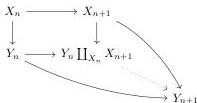

**4.6 Definition.** We define the category $\text{pLimLax}_{n \in \mathbb{N}} \propto \text{-Cat}^{+n}$, the *putative lax limit* of $\propto \text{-Cat}^{+m}$, whose objects are sequences $X_{\bullet} = \{(X_n, f_n)\}_{n \in \mathbb{N}}$ where $X_n \in \propto \text{-Cat}^{+n}$ and $f_n: X_n \to \tau_n X_{n+1}$. By adjunction, objects are in bijection with sequences

$$X_0 \xrightarrow{f_0} X_1 \xrightarrow{f_1} \dots \xrightarrow{f_{n-1}} X_n \xrightarrow{f_n} \dots$$

where each $X_n \in \propto \text{-Cat}^{+n}$.

**4.7 Proposition.** *There exists a left semi-model structure on $\text{pLimLax}_{n \in \mathbb{N}} \propto \text{-Cat}^{+n}$, called the putative lax-limit left semi-model structure and denoted by $\text{pLimLax}_{n \in \mathbb{N}} \propto \text{-Cat}_{\text{Sat-Ind}}^{+n}$, where fibrations and weak equivalences are pointwise fibrations and weak equivalences of the saturated inductive left semi-model structure, and cofibrations are morphisms $h: X_{\bullet} \to Y_{\bullet}$ such that $h_0: X_0 \to Y_0$ is a cofibration in $\propto \text{-Cat}^{+0}$, and for all $n$, the dotted morphism in the following diagrams is a cofibration in $\propto \text{-Cat}^{+i+1}$:*

*Proof.* First, let us notice that $\text{pLimLax}_{n \in \mathbb{N}} \propto \text{-Cat}^{+n}$ can be identified with the full subcategory of functors $X: \mathbb{N} \to \propto \text{-Cat}^{+\infty}$ such that $X_n \in \propto \text{-Cat}^{+n}$.

There is a left semi-model structure on such functors, where fibrations and weak equivalences are pointwise: the Reedy (or projective) model structure as presented at the end of Appendix A. The cofibrations of this model structure are as described in the proposition, and we claim that this model structure “restricts” to $\text{pLimLax}_{n \in \mathbb{N}} \propto \text{-Cat}^{+n}$.

By this last assertion, we mean that given two sequences $X_{\bullet}, Y_{\bullet} \in \text{pLimLax}_{n \in \mathbb{N}} \propto \text{-Cat}^{+n}$ and a map $X \to Y$, the factorizations of $f$ as (cofibration, acyclic fibration) or (acyclic cofibration, fibration) in the Reedy left semi-model structure can be done within $\text{pLimLax}_{n \in \mathbb{N}} \propto \text{-Cat}^{+n}$, which shows that one can deduce all the properties in the definition of semi-model structures from the fact that they are satisfied by the Reedy model structure.

We will prove the claim for the (acyclic cofibration, fibration) factorization system, the proof for the other one being identical. We can construct by induction on $n$ a functorial factorization $X_n \to E_n \to Y_n$ of $p_n$ such that $X_0 \to E_0 \to Y_0$, and $X_n \coprod_{X_{n-1}} E_{n-1} \to E_n \to Y_n$ for $n > 0$, is an acyclic cofibration followed by a fibration of $\propto \text{-Cat}_{\text{Sat-Ind}}^{+n}$. As the functor $\iota_{\infty}: \propto \text{-Cat}^{+m} n_{\text{Sat-Ind}} \to \propto \text{-Cat}_{\text{Sat-Ind}}^{+m}$ is both a left and right Quillen functor, it preserves acyclic cofibrations and fibrations, and the resulting factorization $X \to E \to Y$ is an acyclic cofibration followed by a fibration of the Reedy left semi-model structure.

We can then deduce that the Reedy left semi-model structure “restricts” to $\text{pLimLax}_{n \in \mathbb{N}} \propto \text{-Cat}^{+n}$, which concludes the proof. $\square$

38