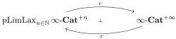

### 4.8 Definition. We have an adjunction

where the left adjoint sends a sequence $X_{\bullet}$ to its colimit:

$$c(X_{\bullet}) := \underset{n \in \mathbb{N}}{\operatorname{Colim}} X_n,$$

and the right adjoint sends an $\infty$-marked $\infty$-category $X$ on the sequence

$$\tau_0(X) \to \cdots \to \tau_n(X) \to \ldots$$

**4.9 Proposition.** *This adjunction induces a Quillen adjunction between $p\text{LimLax}_{n \in \mathbb{N}} \infty\text{-Cat}_{\text{Sat-Ind}}^{+n}$ and $\infty\text{-Cat}_{\text{Sat-Ind}}^{+\infty}$ where the left adjoint preserves weak equivalences and fibrant objects.*

*Proof.* The functor $c$ preserves cofibrations and acyclic cofibrations because of Lemma A.11, and hence is a left Quillen functor.

Secondly, because the left semi-model structure on $\infty\text{-Cat}^{+\infty}$ is $\omega$-combinatorial, its weak equivalences are closed under $\omega$-filtered colimits (this is shown for Quillen model structures as Proposition 7.3 of [17], and for left semi-model structures as Proposition 7.7 of [22]). This implies that the functor $c$ also preserves weak equivalences: if $f: X_{\bullet} \to Y_{\bullet}$ is an equivalence in $\text{pLimLax}_{n \in \mathbb{N}} \infty\text{-Cat}^{+n}$, then the map

$$c(f): \underset{n \in \mathbb{N}}{\operatorname{Colim}} X_n \to \underset{n \in \mathbb{N}}{\operatorname{Colim}} Y_n$$

is a filtered colimit of weak equivalences, and so is a weak equivalence. This implies that $c$ also preserves acyclic cofibrations, which concludes the proof.

**4.10 Proposition.** *There is a left Bousfield localization of $p\text{LimLax}_{n \in \mathbb{N}} \infty\text{-Cat}_{\text{Sat-Ind}}^{+n}$, called the putative limit structure and denoted by $p\text{Lim}_{n \in \mathbb{N}} \infty\text{-Cat}_{\text{Sat-Ind}}^{+n}$, where $X_{\bullet}$ is fibrant if and only if it is fibrant in the putative lax-limit left semi-model model structure and if for all integers $n$, $f_n: X_n \to \tau_n X_{n+1}$ is a weak equivalence. Moreover, weak equivalences between fibrant objects are pointwise equivalences.*

**4.11 Remark.** According to our (unproven) claim (see Remark 4.5) that the results of [11] or [20] can be applied to left semi-model structures, the $\infty$-category obtained as the localization of this Bousfield localization would be equivalent to the limit of the $\infty$-categories obtained as the localization of the $\infty\text{-Cat}^{+n}$ (with the $\tau_n$ functors as transitions).

We need to introduce certain constructions before proving the proposition:

**4.12 Construction.** Let $k$ be any positive integer. We define

$$\underset{i \in \{k, k+1\}}{\text{pLimLax}}(\infty\text{-Cat}^{+i}, \tau_i)$$

39