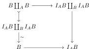
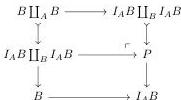
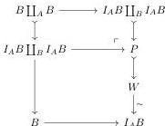
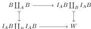

We will proceed in three steps. We first factorize the leftmost map:

We then forms the pushout $P$:

Eventually, we factor the map $P \rightarrow I_A B$ can into a cofibration followed by a weak equivalence.

Which gives a relative cylinder object, and hence a homotopy codiagonal for $\phi$ of the form:

But one can see that the object $W$ we constructed above is itself a relative cylinder object for the map $B \coprod_A B \rightarrow I_A B \coprod_B I_A B$, which concludes the proof.

*Proof of Proposition 4.10.* Let $I_k$ be the set of cofibrations of $\text{pLimLax}_{i \in \mathbb{N}}(\infty\text{-}\mathbf{Cat}^{+i}, \tau_i)$ of the form

$$\{\alpha_k(A \rightarrow B) \rightarrow \alpha_k(B \rightarrow I_A B)\}$$

where $i: A \rightarrow B$ is a generating cofibration of $\infty\text{-}\mathbf{Cat}^{+k}$ and $I_A B$ is a relative cylinder object for $i$.

41