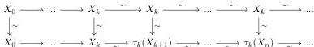

Let $X_{\bullet}$ be a cofibrant and fibrant object of the putative limit left semi-model structure. Because $X_{\bullet}$ and $\tau \in X_{\bullet}$ are fibrant, the second comparison morphism is a weak equivalence if and only if for all $k$, $X_k \rightarrow \text{Colim}_{n \in \mathbb{N}} \tau_k(X_n)$ is a weak equivalence. In order to show this, consider the diagram:

where, by two out of three, all the vertical morphisms are weak equivalences. The previous diagram corresponds to a weak equivalence in the unlocalized left semi-model structure on $\text{pLimLax}_{n \in \mathbb{N}} \infty\text{-Cat}^{+n}$ between $X_{\min(\bullet,k)}$ and $(\tau_k(X_{\bullet}))$. Because the left adjoint $c$ preserves weak equivalences of the unlocalized left semi-model structure by proposition Proposition 4.9, this induces a weak equivalence:

$$X_k \cong \text{Colim}_{n \in \mathbb{N}} X_{\min(n,k)} \rightarrow \text{Colim}_{n \in \mathbb{N}} \tau_k(X_n)$$

## 4.2 Coinductive Localization and Comparison with $\infty\text{-Cat}_{\text{Can}}$

Following [30, Definition 4.2], we can also give a coinductive notion of invertible arrows in an $\infty$-category. In short, an $n$-arrow $a: \pi_{n-1}^- a \rightarrow \pi_{n-1}^+ a$ is said to be coinductively invertible if there is an $n$-arrow $\bar{a}: \pi_{n-1}^+ a \rightarrow \pi_{n-1}^- a$ and two coinductively invertible $(n+1)$-arrows

$$c: \bar{a} \#_{n-1} a \rightarrow \mathbb{I}_{\pi_{n-1}^-} a$$

$$c': a \#_{n-1} \bar{a} \rightarrow \mathbb{I}_{\pi_{n-1}^+} a$$

The notion is called “weakly invertible” in [30]. Note that this is a coinductive definition, that is an arrow is coinductively invertible if there are two such arrows $c$ and $c'$, which themselves have such “weak inverses” $\bar{c}$ and $\bar{c}'$ with four witness $n+2$ arrows, which are themselves coinductively invertible, i.e., have weak inverses and there are eight $(n+3)$-arrows witnessing this, and so on... We can make this definition more formal as follows:

**4.15 Definition.** Let $D$ be an $\infty$-category. An *invertibility set* in $D$ is a set $E = \prod_{n>0} E_n$ with $E_n \subset D_n$ such that, for all $n > 0$ and $a \in E_n$, there exists $\bar{a} \in E_n$ of the form $\bar{a}: \pi_{n-1}^+ a \rightarrow \pi_{n-1}^- a$ and $c, c' \in E_{n+1}$ of the form

$$c: \bar{a} \#_{n-1} a \rightarrow \mathbb{I}_{\pi_{n-1}^-} a \quad \text{and} \quad c': a \#_{n-1} \bar{a} \rightarrow \mathbb{I}_{\pi_{n-1}^+} a.$$

**4.16 Definition.** Let $D$ be an $\infty$-category and $n > 0$. Given $a \in D_n$, the $n$-arrow $a$ is *coinductively invertible* if there exists an invertibility set $E$ such that $a \in E$.

**4.17 Proposition.** Let $D$ be an $\infty$-category and $n > 0$. An $n$-arrow $a$ is *coinductively invertible* if and only if there exists an $n$-arrow $\bar{a}$ of the form $\bar{a}: \pi_{n-1}^+ a \rightarrow \pi_{n-1}^- a$ and two coinductively invertible $(n+1)$-arrows $c, c'$ of the form

$$c: \bar{a} \#_{n-1} a \rightarrow \mathbb{I}_{\pi_{n-1}^-} a \quad \text{and} \quad c': a \#_{n-1} \bar{a} \rightarrow \mathbb{I}_{\pi_{n-1}^+} a.$$

43