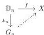

*Proof.* This is [32, Lemme 1.1.8].

**4.18 Lemma.** *Let $X$ be an $\infty$-category, and $M$ the set of coinductively invertible arrows. The set $M$ satisfies the two following properties:*

(2) *For all $c: a \rightarrow b$ in $M$, $a \in M \Leftrightarrow b \in M$.*

*Proof.* The first point is the third and the fourth point of example 1.1.9 of [32], and the second one is a consequence of proposition 1.1.10 of *loc. cit.*

**4.19 Proposition.** *If $X$ is a fibrant $m$-marked $\infty$-category, all marked arrows in $X$ are coinductively invertible in the underlying $\infty$-category.*

*Proof.* The Lemma 3.23 directly implies that the set of all marked arrows is an invertibility set. By definition, all marked arrows are then coinductively invertible.

**4.20 Proposition.** *Let $X$ be an $\infty$-category and $M$ the set of coinductively invertible arrows. The marked $\infty$-category $(X, M)$ is then fibrant in the saturated inductive semi-model structure.*

*Proof.* Proposition 4.17 shows that $(X, M)$ satisfies point (1) of Lemma 3.37, which is a characterization of the fibrant objects in the saturated inductive semi-model structure (see Theorem 3.38).

Next we remark that coinductively invertible arrows can be characterized using a lifting property:

**4.21 Definition.** Let $G_1$ be the $\infty$-category obtained from the factorization of $\mathbb{D}_1 \rightarrow \mathbb{D}_0$ as a cofibration $k_1: \mathbb{D}_1 \rightarrow G_1$ followed by an acyclic fibration $t_1: G_1 \rightarrow \mathbb{D}_1$. We then define $G_n := \Sigma^{n-1} G_1$ and $k_n := \Sigma^{n-1} k_1: \mathbb{D}_n \rightarrow G_n$, $t_n := \Sigma^{n-1} t_1: G_n \rightarrow \mathbb{D}_{n-1}$. Let us recall that the definition of the functor $\Sigma^{n-1}$ is given in Definition 2.6. As the suspension preserves acyclic fibrations and cofibrations, the pair $(k_n, t_n)$ is a factorization of $\mathbb{D}_n \rightarrow \mathbb{D}_{n-1}$ into a cofibration followed by an acyclic fibration.

**4.22 Proposition.** *Let $X$ be an $\infty$-category, and $f$ an $n$-arrow of $X$. There exists a lifting in the following diagram:*

*if and only if $f$ is coinductively invertible.*

*Proof.* This is a reformulation of lemma 4.36 of [30].

We recall now the model structure on $\infty$-Cat constructed in [30].

**4.23 Theorem.** *There exists a model structure on $\infty$-Cat, called the canonical model structure and denoted by $\infty$-Cat$_{Can}$ such that*

44