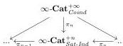
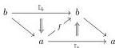
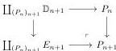

construction does not produce an equivalence between this limit and the canonical model structure, contrary to what seemed to have been believed previously. Here we are using “limit” as “the (homotopy) limit of the corresponding tower of associated $(\infty, 1)$-categories,” without referring to any specific model.

We will show this by building a morphism $C_\infty \rightarrow D_\infty$ that is not an equivalence of the coinductive model structure, but becomes invertible in the limit of the $\pi$-tower. Though we believe this is not the case, this still leaves open the possibility that the limit of the $\pi$-tower is equivalent to a further localization of the coinductive left semi-model structure, where this morphism (and probably others) would become invertible. If this were the case, then the limit of the $\pi$-tower would be equivalent to a localization $\infty$-Cat$_{\text{Can}}$.

More precisely, we will show:

**4.31 Proposition.** *There exists a morphism $f: C_\infty \rightarrow D_\infty$ between cofibrant $\infty$-marked $\infty$-categories such that*

(1) $f$ is not a weak equivalence in the coinductive left semi-model structure on $\infty$-marked $\infty$-categories defined in Definition 4.16,
(2) for all integers $n$, $\pi_n f$ is a weak equivalence in the saturated inductive left semi-model structure on $n$-marked $\infty$-categories defined in Theorem 3.38.

As an immediate consequence, we get:

**4.32 Corollary.** *The $(\infty, 1)$-functor from the $(\infty, 1)$-category associated to $\infty$-Cat$_{\text{Can}}$ to the limit of the diagram of $(\infty, 1)$-categories associated to $(\infty$-Cat$^{+n}_{\text{Sat-Ind}}, \pi_n)$ induced by the diagram*

*is not an equivalence.*

**4.33 Construction.** Let $E_1$ denote the following 2-polygraph:

and $E_n := \Sigma^{n-1} E_1$. Let us recall that the definition of the functor $\Sigma^{n-1}$ is given in Definition 2.6. When writing $\mathbb{D}_n \rightarrow E_n$, we will always consider the morphism representing the $n$-arrow $\Sigma^{n-1} f$. We define by induction a sequence of polygraphs $(P_n)_{n \in \mathbb{N}}$. We set $P_0 := \mathbb{D}_1$ and $P_n$ as the pushout:

48