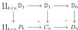

where $(P_n)_{n+1}$ is the set of $(n+1)$-arrows of $P_n$.

Informally, taking a pushout along $\mathbb{D}_{n+1} \rightarrow E_n$ means freely adding a left and a right inverse to an arrow $f$ (except there is no marking yet) and so $P_{n+1}$ is constructed by freely adding left and right inverses to all $(n+1)$-arrows of $P_n$.

When writing $\mathbb{D}_1 \rightarrow P_n$, we will always consider the morphism representing the 1-arrow $P_0 \rightarrow P_n$. Finally, for $n \in \mathbb{N} \cup \{\infty\}$ we define $C_n$ and $D_n$ as the following pushouts:

The morphism $C_\infty \rightarrow D_\infty$ will be the map $f$ of Proposition 4.31. The informal idea is that in $C_\infty$ the 1-arrow corresponding to the vertical map $\mathbb{D}_1 \rightarrow C_\infty$ has “coinductive inverse up to height $n$” for all $n$, but is not coinductively invertible. So when $C_\infty$ is seen as an object of the canonical (or coinductive) model structure this 1-arrow is not invertible, but as soon as we localize to make all the $n$-arrows invertible for some integer $n$, then this 1-arrow will become invertible. In contrast in $D_\infty$ this arrow becomes an identity, so it is invertible from the start. In the rest of the section, we will justify this rigorously.

We begin by showing the first point of Proposition 4.31, namely that $C_\infty \rightarrow D_\infty$ is not a weak equivalence in the coinductive left semi-model structure.

**4.34 Lemma.** *Let $P$ be a polygraph and $f$ a coinductively invertible $k$-arrow in $P$. For every $k$-generator $g$ appearing in the decomposition of $f$, there exists a sequence of generating arrows $(g_n)_{n \in \mathbb{N}}$ such that*

1. (1) for $n > 0$, $g_n$ is a $(n+k)$-generator and $g_0 = g$,
2. (2) for $n > 0$, $g_n$ appears in the decomposition of the source of $g_{n+1}$.

*Proof.* We show this result by coinduction on $k$. Suppose the result is true for all $(k+1)$-arrows, and let $f: a \rightarrow b$ be a coinductively invertible $k$-arrow, and $g$ a $k$-generator appearing in the decomposition of $f$. There exists a $k$-arrow $f': b \rightarrow a$ and a coinductively invertible $(n+1)$-arrow $\alpha: f\#_{k-1}f' \rightarrow \mathbb{I}_a$. As $g$ is a $k$-generator appearing in the decomposition of $f\#_{k-1}f'$ (which is the source of $\alpha$), we can find a $(k+1)$-generator $\beta$ appearing in the decomposition of $\alpha$ and such that $g$ is in the decomposition of the source of $\beta$. As $\alpha$ is coinductively invertible, one can continue this process coinductively starting from $\beta$ to build a sequence of generators $(\beta_n)_{n \in \mathbb{N}}$ satisfying the desired property. We then set $g_0 := g$, and $g_n := \beta_{n-1}$. This sequence also satisfies the desired property. $\square$

**4.35 Corollary.** *The $\infty$-categories $C_\infty$ and $D_\infty$ have no coinductively invertible arrows except identities.*

*Proof.* We will show this assertion for $C_\infty$; the proof for $D_\infty$ is essentially the same. We proceed by contradiction: let $f$ be a non-identity coinductively invertible $k$-arrow of $C_\infty$. As $f$ is not an identity, there must be at least one $k$-generator $g$ appearing in its decomposition. Since $C_\infty$ is a polygraph, one can

49