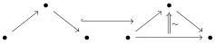

**4.56 Lemma.** *The strictification functor sends complicial horn inclusions to acyclic cofibrations of the saturated inductive left semi-model structure for m-marked ∞-categories.*

*Proof.* The morphism |Λ¹[2]| → |Δ[2]¹| corresponds to the following inclusion of marked ∞-categories:

which is obviously an equation. The two morphisms |Λ⁰[2]| → |Δ⁰[2]| and |Λ²[2]| → |Δ²[2]| are respectively equal to eq¹·¹ and eq¹·¹. Furthermore, we can see that for all 0 < k < n, we have:

$$\Delta^k[n] = \Delta[k-2] \star \Delta^1[2] \star \Delta[n-k-2]$$

and Λᵏ[n] is the sub-object:

$$\begin{array}{l} \partial\Delta[k-2] \star \Delta^1[2] \star \Delta[n-k-2] \\ \cup \quad \Delta[k-2] \star \Lambda^1[2] \star \Delta[n-k-2] \\ \cup \quad \Delta[k-2] \star \Delta^1[2] \star \partial\Delta[n-k-2]. \end{array}$$

By Lemma 4.55, the strictification functor commutes with the join. Proposition 4.51 then implies that |Λᵏ[n]| → |Δᵏ[n]| is an acyclic cofibration. We proceed analogously for the cases k = 0 and k = n.

**4.57 Theorem.** *The strictification functor and the stratified Street nerve form a Quillen adjunction between the model structure for m-complicial sets and the saturated inductive left semi-model structure on ∞-Cat⁺ᵐ.*

*Proof.* Because of Lemma 4.56, it remains to show that complicial thinness extensions, saturation extensions, and m-triviality extensions are sent to acyclic cofibrations. Let i be such a morphism. According to Proposition 4.54, any fibrant object of the saturated inductive left semi-model structure has the right lifting property against |i|. As |i| is an identity on the underlying ∞-category, lifts against it are unique if they exist. This implies that any morphism between fibrant objects has the right lifting property against |i|, and this morphism is then an acyclic cofibration. This concludes the proof.

We can use this to generalize the results from [32]: The stratified Street nerve:

$$\mathcal{N}: \infty\text{-Cat} \to \mathbf{Strat}^{+m}$$

introduced in [32], is exactly the stratified Street nerve N of the present paper combined with the fully faithful inclusion ∞-Cat ⊂ ∞-Cat⁺ᵐ constructed in Section 4.2, which makes all coinductively invertible arrows marked. Hence:

**4.58 Proposition.** *Let f: X → Y be a fibration (resp. an acyclic fibration, resp. a weak equivalence) of the canonical model structure ∞-CatCan, then its stratified Street nerve N(f): N(X) → N(Y) is a fibration (resp. an acyclic fibration, resp. a weak equivalence) in the Verity model structure Stratᵥ⁺ᵐ.*

56