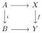
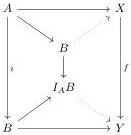

Various equivalent characterizations of Quillen equivalences can be found in Proposition 2.4.5 of [23].

The following result will be used to characterize weak equivalences, or at least the weak equivalences between fibrant objects, in various left semi-model structures:

**A.7 Proposition.** Let $\mathcal{C}$ be a left semi-model category, and let $f: X \to Y$ be a morphism between two fibrant objects. Then $f$ is a weak equivalence if and only if $f$ has the so-called "homotopy right lifting property" against all cofibrations between cofibrant objects. That is, for each cofibration $i: A \mapsto B$ with cofibrant domain in $\mathcal{C}$ and any commutative square:

there exist dotted morphisms making the following diagram commute:

where $I_A B$ is a relative cylinder object for $i$, that is, a middle object of some (cofibration, anodyne fibration) factorization of the codiagonal map of $i$:

$$B \coprod_A B \mapsto I_A B \stackrel{\sim}{\twoheadrightarrow} B$$

Moreover, if $I$ is a generating set of cofibrations, then it is sufficient to check this for $i \in I$.

This is well known for Quillen model categories and proved in the more general setting of weak model categories in Appendix A of [23] (see Remark A.2.7).

We will occasionally need to take left Bousfield localizations of left semi-model categories. This is actually easier than Bousfield localization of Quillen model categories as it no longer requires any properness assumptions. It was shown in [9] that left Bousfield localization of combinatorial left semi-model categories at a set of maps yields another left semi-model category. This result was later reproved and generalized in [24] to include both left and right Bousfield localizations of combinatorial and accessible left semi-model categories, but we will only need the version from [9] here:

61