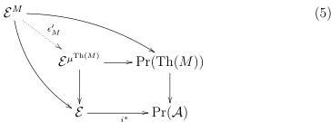

By taking the essential image of the top horizontal composite we get a map $\eta_{\mathcal{K}} : \mathcal{K} \to \mathrm{Th}(\mu^{\mathcal{K}})$. Since we can view Definition 5.1 as lying in the $\infty$-category of locally presentable $\infty$-categories and accessible functors ([15, Definition 5.5.3.1]) the operation of taking adjoints is functorial in $\mathcal{K}$ ([15, Corollary 5.5.3.4]).

Essentially surjective functors and faithful functors form an orthogonal factorization system on $\mathbf{Cat}_{\infty}$ (see Lemma 5.4). Thus, the operation of taking essential image is functorial by [15, Lemma 5.2.8.19], so $\eta_{\mathcal{K}}$ is natural in $\mathcal{K}$. This will be the unit of our adjunction.

**Construction 5.7.** We have a diagram natural in $M$

The Yoneda functoriality described in Proposition 4.9 gives us the naturality of the outer square, and the inner square is just Definition 5.1. $\epsilon_M'$ comes from the universal property of pullback and is hence (contravariantly) natural in $M$. Through the contravariant equivalence of Theorem 3.22 this corresponds to a natural transformation $\epsilon_M : \mu^{\mathrm{Th}(M)} \to M$, which will be the counit our the monad-theory adjunction.

**Lemma 5.8.** $\eta \circ \mathrm{Th}$ and $\mathrm{Th} \circ \epsilon$ are both natural equivalences.

*Proof.* By Lemma 2.1 to show that $\eta \circ \mathrm{Th}$ and $\mathrm{Th} \circ \epsilon$ are natural equivalences, it suffices to show that for each monad $M$, the functors $\eta_{\mathrm{Th}(M)}$ and $\mathrm{Th}(\epsilon_M)$ are equivalences. We will first show that $\eta_{\mathrm{Th}(M)} \circ \mathrm{Th}(\epsilon_M)$ is an equivalence. Then we will show that each $\eta_{\mathrm{Th}(M)}$ is an equivalence, from which the required results will follow.

Given a pretheory $\mathcal{K}$, we write $G_{\mathcal{K}} : \mathcal{E}^{\mu^{\mathcal{K}}} \to \mathrm{Pr}(\mathcal{K})$ for the top horizontal map in the pullback of Definition 5.1. We write $Y_M : \mathcal{E}^M \to \mathrm{Pr}(\mathrm{Th}(M))$ for the restricted Yoneda embedding. $Y_M$ restricts to an equivalence $S : \mathrm{Th}(M) \simeq im(y_{\mathrm{Th}(M)})$, and the homotopy inverse $\Psi : im(y_{\mathrm{Th}(M)}) \to \mathrm{Th}(M)$

34